<!-- IMPLEMENTATION_PLAN.md -->
# 대용량 사내 문서 RAG 통합 시스템 구현 계획

- 기준일: 2026-08-12
- 대상 장비: MacBook Pro M4 Max, 통합 메모리 36GB
- 기준 모델: `mlx-community/Qwen3.6-27B-4bit`
- 문서 상태: 구현 기준안

실제 완료 범위, 검사 수치와 다음 구현 순서는
[docs/implementation-status.md](docs/implementation-status.md)에서 관리한다.

## 1. 목표 디렉터리 및 파일 구조

```text
RAG/
├── README.md
├── IMPLEMENTATION_PLAN.md
├── .gitignore
├── .env.example
├── pyproject.toml
├── requirements.txt
├── requirements-dev.txt
├── uv.lock
├── config/
│   ├── default.yaml
│   ├── development.yaml
│   └── production.yaml
├── docs/
│   ├── README.md
│   ├── architecture.md
│   ├── module-design.md
│   ├── contracts.md
│   ├── data-model.md
│   ├── pipeline.md
│   ├── orchestration-workflow.md
│   ├── configuration.md
│   ├── operations.md
│   ├── security.md
│   ├── evaluation.md
│   ├── implementation-roadmap.md
│   ├── implementation-status.md
│   └── adr/
│       ├── 0001-clean-architecture.md
│       ├── 0002-local-model-runtime.md
│       ├── 0003-vector-store.md
│       ├── 0004-web-egress-policy.md
│       ├── 0005-folder-revision-boundary.md
│       └── 0006-evidence-ledger-orchestration.md
├── data/
│   ├── before/
│   │   └── <dataset>/
│   └── after/
│       └── runs/
│           └── <run_id>/
│               ├── documents/
│               ├── _reports/
│               └── run-manifest.json
├── skills/
│   └── manage-document-revisions/
│       ├── SKILL.md
│       ├── agents/openai.yaml
│       ├── references/permission-model.md
│       └── scripts/
│           ├── prepare_run.py
│           ├── compare_run.py
│           └── test_document_workspace.py
├── scripts/
│   ├── benchmark_hardware.py
│   ├── download_models.py
│   ├── build_evaluation_set.py
│   └── verify_installation.py
├── src/
│   └── enterprise_rag/
│       ├── __init__.py
│       ├── bootstrap.py
│       ├── domain/
│       │   ├── __init__.py
│       │   ├── entities/
│       │   │   ├── document.py
│       │   │   ├── chunk.py
│       │   │   ├── duplicate_cluster.py
│       │   │   ├── claim.py
│       │   │   ├── evidence.py
│       │   │   └── synthesis_artifact.py
│       │   ├── value_objects/
│       │   │   ├── identifiers.py
│       │   │   ├── provenance.py
│       │   │   ├── security_label.py
│       │   │   └── scores.py
│       │   ├── policies/
│       │   │   ├── classification_policy.py
│       │   │   ├── canonicalization_policy.py
│       │   │   ├── web_egress_policy.py
│       │   │   └── synthesis_policy.py
│       │   └── exceptions.py
│       ├── application/
│       │   ├── __init__.py
│       │   ├── dto/
│       │   ├── ports/
│       │   │   ├── document_source.py
│       │   │   ├── document_workspace.py
│       │   │   ├── document_comparator.py
│       │   │   ├── document_parser.py
│       │   │   ├── chunker.py
│       │   │   ├── embedder.py
│       │   │   ├── vector_index.py
│       │   │   ├── metadata_repository.py
│       │   │   ├── language_model.py
│       │   │   ├── web_search.py
│       │   │   ├── artifact_repository.py
│       │   │   ├── secret_store.py
│       │   │   └── job_queue.py
│       │   ├── use_cases/
│       │   │   ├── inventory_documents.py
│       │   │   ├── ingest_document.py
│       │   │   ├── prepare_revision_run.py
│       │   │   ├── compare_revision_run.py
│       │   │   ├── classify_chunks.py
│       │   │   ├── deduplicate_chunks.py
│       │   │   ├── extract_claims.py
│       │   │   ├── validate_claims.py
│       │   │   ├── synthesize_topics.py
│       │   │   └── publish_artifacts.py
│       │   └── services/
│       │       ├── pipeline_orchestrator.py
│       │       ├── resource_scheduler.py
│       │       └── checkpoint_manager.py
│       ├── infrastructure/
│       │   ├── __init__.py
│       │   ├── sources/
│       │   │   └── filesystem_source.py
│       │   ├── parsing/
│       │   │   ├── pdf_parser.py
│       │   │   ├── docx_parser.py
│       │   │   ├── html_parser.py
│       │   │   ├── markdown_parser.py
│       │   │   └── ocr_parser.py
│       │   ├── chunking/
│       │   │   └── structure_aware_chunker.py
│       │   ├── embeddings/
│       │   │   └── bge_m3_embedder.py
│       │   ├── vector/
│       │   │   ├── faiss_index.py
│       │   │   └── qdrant_index.py
│       │   ├── llm/
│       │   │   └── mlx_qwen_client.py
│       │   ├── search/
│       │   │   ├── tavily_search.py
│       │   │   └── disabled_search.py
│       │   ├── persistence/
│       │   │   ├── sqlite_repository.py
│       │   │   └── filesystem_artifact_repository.py
│       │   ├── workspace/
│       │   │   ├── folder_revision_workspace.py
│       │   │   └── folder_tree_comparator.py
│       │   ├── security/
│       │   │   └── macos_keychain_store.py
│       │   └── jobs/
│       │       └── local_job_queue.py
│       └── presentation/
│           ├── __init__.py
│           ├── cli.py
│           └── api.py
├── tests/
│   ├── unit/
│   ├── integration/
│   ├── architecture/
│   ├── security/
│   ├── performance/
│   ├── acceptance/
│   └── fixtures/
└── var/
    ├── database/
    ├── objects/
    ├── normalized/
    ├── indexes/
    ├── artifacts/
    ├── checkpoints/
    ├── quarantine/
    └── logs/
```

`data/before/`는 데이터 관리자가 준비하는 불변 입력이고 `data/after/runs/<run_id>/`는 AI가 만드는 실행별 수정본이다. `var/`는 DB, CAS, 인덱스, 체크포인트 같은 재생성 가능한 내부 실행 데이터 전용이며 Git 추적에서 제외한다. 원본 시스템과의 동기화 및 최종 write-back은 이 런타임 밖의 승인된 절차로 수행한다.

## 2. 검토 결론과 핵심 보완 사항

기존 계획의 방향인 경량 임베딩 트랙과 고성능 LLM 트랙 분리는 타당하다. 다만 안정적인 사내 운영을 위해 다음 항목을 수정한다.

| 기존 가정 | 검토 결과 | 보완 결정 |
| --- | --- | --- |
| 36GB를 VRAM처럼 고정 분할 | Apple Silicon은 CPU와 GPU가 같은 통합 메모리를 사용하므로 고정 파티션이 아니다 | 고정 할당표 대신 단계별 적재, 동시 실행 제한, 메모리 압력 기반 백프레셔를 적용한다 |
| Qwen 3.6 27B Q4_K_M이 약 16GB | `Qwen/Qwen3.6-27B`와 MLX 4비트 변환본 약 16.1GB를 확인했다 | MLX 4비트 모델을 기준으로 하되 정확한 상주 메모리와 처리량은 대상 장비에서 측정한 뒤 확정한다 |
| KV 캐시 10GB가 32K 토큰을 보장 | 캐시 크기는 모델 구조, 캐시 정밀도, 런타임 구현에 따라 달라진다 | 16K에서 시작해 24K와 32K를 순차 검증하고, 32K는 성능 시험 통과 시에만 운영값으로 승격한다 |
| 키워드 기준 벡터 하나로 기술 문서 판별 | 임베딩은 분류기 자체가 아니며 단일 임계값은 오탐과 누락에 취약하다 | 규칙, 문서 메타데이터, 임베딩 중심점, 불확실성 구간을 결합한 3방향 라우팅을 사용한다 |
| 유사도 0.90 이상 청크 삭제 | 임계값은 코퍼스별로 달라지고 최신 문서가 항상 권위 있는 문서는 아니다 | 정확 중복, 근사 텍스트 중복, 의미 중복을 단계화하고 원본 삭제 없이 정규본 포인터와 중복 군집을 저장한다 |
| 웹 결과로 사내 문서를 직접 최신화 | 내부 고정 버전과 공개 최신 버전은 목적이 다르며 외부 검색은 정보 유출 위험이 있다 | 원문은 불변으로 보존하고 검증 근거, 차이, 제안 수정본을 별도 생성한 뒤 승인 절차를 거친다 |
| AI에 Confluence API 키 제공 | 모델·스킬·문서 내용에 자격정보가 노출되고 원본 시스템 write-back 경계가 흐려진다 | Confluence 연동을 제거하고 외부에서 승인된 스냅샷을 `data/before`에 배치하며 AI는 현재 `data/after` run만 쓴다 |
| K-means 후 한 번에 대량 합성 | 고정 K와 대형 단일 프롬프트는 주제 혼합, 근거 소실, 환각 위험이 있다 | Evidence·Claim Ledger·Coverage Matrix로 Task를 계획하고 검증된 섹션을 결정적으로 조립한다 |
| 단일 거대 Markdown을 최종 산출물로 사용 | 변경 추적과 부분 재생성이 어렵다 | 주제별 문서와 인덱스를 정본으로 만들고 단일 Markdown은 선택적 내보내기로 제공한다 |

## 3. 목표와 비목표

### 3.1 목표

1. 외부에서 승인되어 `data/before`에 배치된 PDF, DOCX, HTML, Markdown, 텍스트 문서를 증분 수집한다.
2. 원본 위치, 문서 버전, 페이지와 섹션, ACL, 보안 등급을 모든 청크와 산출물까지 전파한다.
3. 저비용 트랙에서 기술 관련성 판정, 검색 인덱싱, 중복 후보 생성을 수행한다.
4. 고비용 트랙은 검증 가치가 높은 주장과 최종 합성에만 Qwen 3.6 27B를 사용한다.
5. 모든 생성 문장을 내부 근거 또는 외부 근거에 연결하고 충돌과 불확실성을 노출한다.
6. 중단 후 재개, 증분 재처리, 모델 교체가 가능한 재현성 있는 파이프라인을 구현한다.
7. 기본 동작을 로컬 전용으로 유지하고 외부 통신은 정책과 승인을 통과한 검색 요청으로 제한한다.
8. 수정 전 입력과 수정 후 실행을 폴더로 분리하고 파일별 해시·상태·diff를 자동 생성한다.
9. 기존 Presentation에 통합한 로컬 GUI의 실행/설정 탭에서 원본 폴더, Hugging Face 로컬 모델,
   추가 시스템 지침, Job 제어, 건수 진행률, 체크포인트와 완료 결과를 관리한다.

### 3.2 비목표

1. 원본 사내 문서를 자동 수정하거나 삭제하지 않는다.
2. Confluence API 연결, 자격정보 보관, 원본 시스템 자동 write-back을 구현하지 않는다.
3. 모델이 판단한 최신 정보를 승인 없이 정본으로 게시하지 않는다.
4. 262K 이상의 모델 최대 컨텍스트를 36GB 장비의 운영 목표로 삼지 않는다.
5. 외부 웹 페이지의 지시문을 도구 호출이나 코드 실행으로 연결하지 않는다.

## 4. 아키텍처 원칙

### 4.1 Clean Architecture와 Hexagonal Architecture

- `domain`은 파서, MLX, BGE, 벡터 DB, 웹 검색 SDK를 import하지 않는다.
- `application`은 유스케이스와 포트만 정의하며 구체 라이브러리에 의존하지 않는다.
- `infrastructure`는 포트의 어댑터를 구현한다.
- `presentation`은 CLI 또는 API 입력을 DTO로 변환하고 유스케이스를 호출한다.
- 의존성 조립은 `bootstrap.py` 한 곳에서 수행한다.
- 파일, 모델 세션, DB 연결, HTTP 클라이언트, 작업 큐는 컨텍스트 관리자와 명시적 `close()` 계약으로 소유권을 관리한다.
- 아키텍처 테스트로 바깥 계층에서 안쪽 계층으로만 의존하는 규칙을 강제한다.

### 4.2 불변 원본과 계보

- 원본은 콘텐츠 해시와 수집 시각을 기록한 불변 `DocumentRevision`으로 저장한다.
- 정규화, 청킹, 임베딩, 중복 군집, 주장 추출, 합성의 각 단계에 입력 해시와 실행 버전을 기록한다.
- 모델 ID, 모델 리비전, 양자화 방식, 프롬프트 버전, 설정 해시를 실행 레코드에 저장한다.
- 파생 산출물은 언제든 원본과 실행 설정으로 재생성할 수 있어야 한다.

### 4.3 멱등성과 체크포인트

- 문서 해시와 파이프라인 버전이 같으면 재처리하지 않는다.
- 단계별 상태는 `pending`, `running`, `completed`, `failed`, `quarantined`로 기록한다.
- 각 단계는 완료 결과를 원자적으로 커밋한 후 다음 작업을 큐에 넣는다.
- 장시간 Claim 추출은 Evidence 한 건의 구조 검증 직후 write-once partial checkpoint를 커밋한다.
- 모델 생성 조각은 검증 결과와 분리된 Job별 append-only 관측 journal로 기록한다.
- 프로세스가 종료되어도 마지막 완료 단계부터 재개한다.

### 4.4 폴더 리비전과 최소 권한

- `data/before`는 읽기 전용이며 AI, Qwen 워커, 비교 도구가 수정·삭제·이동하지 않는다.
- 수정 작업은 고유한 `data/after/runs/<run_id>/documents`에만 수행하고 기존 run을 덮어쓰지 않는다.
- Worker 사전 점검은 `after_root` 디렉터리를 생성해 링크·중첩·쓰기 실패를 즉시 검출한다.
- 중간 산출물과 비차단 품질 지표는 `var/jobs/<job_id>`에 기록하고, 조립 결과와 저장 무결성을 확인한 뒤 after의 `runs/<run_id>`를 생성한다.
- 준비 단계는 입력 파일의 상대 경로, 바이트 수, SHA-256을 매니페스트로 고정한다.
- 비교 단계는 추가·수정·삭제·동일 상태, 전후 해시, UTF-8 텍스트 unified diff를 생성한다.
- finalization 후 run은 불변으로 취급하며 후속 수정은 새 run으로 만든다.
- 심볼릭 링크, junction, 특수 파일, 경로 탈출을 fail closed로 거부한다.
- 스킬과 Qwen 워커는 Confluence, 비밀 저장소, 임의 네트워크, `data/before` 쓰기 권한을 갖지 않는다.

## 5. Two-Track 전체 데이터 흐름

```mermaid
flowchart LR
    X["외부 승인 내보내기"] --> A["data/before 불변 스냅샷"]
    A --> B["인벤토리·ACL·해시"]
    B --> C["파싱·정규화·구조 인식 청킹"]
    C --> D["정확 중복 제거"]
    D --> E["Track A: BGE-M3·규칙 기반 라우팅"]
    E --> F["벡터 인덱스·중복 후보 군집"]
    E --> G["보류·비기술 문서 보존소"]
    F --> H["검증 가치와 위험도 산정"]
    H --> I["Track B: Qwen 주장 추출"]
    I --> J{"외부 검증 허용 여부"}
    J -->|"허용"| K["질의 비식별화·도메인 정책"]
    K --> L["웹 검색·근거 스냅샷"]
    J -->|"차단"| M["내부 근거만 사용"]
    L --> N["충돌 탐지·수정 제안"]
    M --> N
    N --> O["사람 승인"]
    O --> P["Claim Ledger·Coverage·Task DAG"]
    P --> S["Task 생성·결정적 문서 조립"]
    S --> Q["품질 지표 기록 후 data/after 신규 run"]
    Q --> R["사람 검토·별도 게시"]
```



### 5.1 Track A: 저비용 인제스천·검색 준비 트랙

Track A는 대량 처리량, 재실행 비용, 높은 재현성을 우선한다. BGE-M3를 로드해 배치 임베딩을 수행하고 완료 후 메모리에서 해제한다.

처리 순서는 다음과 같다.

1. `data/before` 인벤토리와 sidecar 접근 등급 수집
2. MIME과 확장자 검증, 악성 또는 암호화 파일 격리
3. 콘텐츠 해시 기반 파일 단위 정확 중복 탐지
4. 포맷별 파싱과 구조 보존 정규화
5. Qwen 토크나이저 기준 계층형 청킹
6. 규칙과 BGE-M3를 결합한 관련성 라우팅
7. MinHash 또는 SimHash 기반 근사 텍스트 중복 후보 생성
8. 임베딩 기반 의미 중복 후보 생성
9. 벡터와 메타데이터 인덱싱
10. 고비용 트랙 대상 우선순위 산정

### 5.2 Track B: 검증·추론·합성 트랙

Track B는 정확성, 근거 보존, 감사 가능성을 우선한다. 한 번에 하나의 Qwen 작업만 수행하며 Track A의 임베딩 배치와 기본적으로 동시에 실행하지 않는다.

처리 순서는 다음과 같다.

1. 기술 관련성과 검증 가치가 높은 청크에서 원자적 주장을 추출
2. 버전, 날짜, 지원 종료, 보안 권고, 공개 API 스펙처럼 외부 검증 가능한 주장만 선별
3. 내부 식별자 제거와 외부 반출 정책 평가
4. 허용된 공개 질의만 웹 검색으로 전송
5. 검색 결과를 비신뢰 데이터로 저장하고 본문 지시문을 실행하지 않음
6. 내부 현재 상태, 공개 최신 상태, 차이, 적용 권고를 분리해 작성
7. 상충 근거와 낮은 신뢰도를 승인 큐로 전송
8. 승인된 Evidence로 Claim Ledger와 Coverage Matrix를 구축
9. 고정 TaskPacket으로 섹션을 작성·검증하고 코드로 최종 조립

## 6. 단계별 상세 구현 계획

### 6.1 0단계: 하드웨어·런타임 성능 스파이크

본 구현에 앞서 대상 Mac에서 다음 조합을 실제 측정한다.

| 항목 | 측정 조건 |
| --- | --- |
| Qwen 모델 | `mlx-community/Qwen3.6-27B-4bit` |
| 런타임 | 최신 호환 `mlx-vlm`, 검증 가능한 경우 `mlx-lm` 서버 |
| 프롬프트 길이 | 4K, 16K, 24K, 32K 토큰 |
| 출력 길이 | 512, 2048 토큰 |
| 측정값 | 모델 로드 시간, 첫 토큰 지연, 입력 처리량, 출력 토큰/초, 최고 상주 메모리, 메모리 압력, 열 스로틀링 |
| BGE-M3 | 배치 크기 4, 8, 16과 길이 512, 1024 토큰 |
| 동시성 | BGE 단독, Qwen 단독, 동시 적재 |

운영 기본값은 16K 컨텍스트로 시작한다. 24K와 32K는 최악 조건에서 스왑이 발생하지 않고, 메모리 압력이 정상 범위이며, 최소 여유 메모리 6GB를 유지하는 경우에만 허용한다. 동시 적재가 불안정하면 리소스 스케줄러가 BGE 세션을 종료한 뒤 Qwen 세션을 시작한다.

완료 기준은 재현 가능한 벤치마크 JSON, 권장 컨텍스트, 배치 크기, 동시성, 타임아웃 값이 `config/production.yaml` 후보로 확정되는 것이다.

### 6.2 1단계: 인벤토리와 인제스천

- 입력 파일 시스템은 `data/before`의 해석된 절대 경로 하나로 제한하고 운영체제와 애플리케이션 양쪽에서 읽기 전용으로 취급한다.
- Confluence를 포함한 원본 시스템 내보내기는 외부 책임이며 RAG 설정에는 base URL, API 키, access token, cookie를 두지 않는다.
- 외부 내보내기는 가능한 경우 페이지 ID, 버전, 수정 시각, 작성자, 보안 등급의 비밀 제거 sidecar를 함께 배치한다. sidecar가 없으면 가장 제한적인 기본 ACL과 파일 기반 버전을 사용한다.
- 모든 실행 전에 신규 `data/after/runs/<run_id>`를 준비하고 입력 해시 매니페스트를 생성한다.
- 파일명만 신뢰하지 않고 MIME과 실제 포맷을 교차 확인한다.
- 비밀번호가 걸린 파일, 손상 파일, 과대 파일, 미지원 파일은 실패시키지 않고 `quarantine`에 사유와 함께 기록한다.
- PDF는 텍스트 레이어를 우선하고 텍스트 밀도가 낮은 페이지만 OCR 큐로 보낸다.
- 표, 코드 블록, 제목 계층, 목록, 페이지 번호를 정규화 문서의 구조 요소로 보존한다.
- 원본 콘텐츠 해시가 동일한 파일은 별도 위치 메타데이터만 병합한다.

완료 기준은 지원 포맷별 골든 파일에서 텍스트와 구조가 재현되고, 손상 파일 하나가 전체 배치를 중단시키지 않으며, 동일 입력의 재실행이 새 파생 데이터를 만들지 않는 것이다.

### 6.3 2단계: 구조 인식 청킹

고정 문자 수보다 토큰과 문서 구조를 함께 사용한다.

- 목표 크기: 800토큰
- 최대 크기: 1,200토큰
- 일반 중첩: 10~15%
- 제목, 절, 표, 코드 블록의 경계를 우선 보존
- 표와 코드는 의미 없는 중간 분할을 피하고 필요 시 부모 요약과 자식 청크를 함께 생성
- 청크마다 상위 제목 경로와 인접 청크 ID를 기록
- 페이지·문단·셀 범위를 `SourceSpan`으로 저장
- 임베딩용 텍스트와 인용 표시용 원문을 분리해 보존

1000/200 설정은 초기 후보일 뿐 고정값으로 간주하지 않는다. 검색 평가 세트의 Recall@K와 합성 인용 정확도를 기준으로 600/900/1200 토큰 후보를 비교한다.

### 6.4 3단계: 기술 문서 분류

단일 키워드 벡터 대신 다음 점수를 결합한다.

1. 데이터셋, 상대 경로, 작성 부서, 태그의 메타데이터 점수
2. 코드, 명령, 버전 패턴, 기술 용어의 규칙 점수
3. 최소 200개 수동 라벨 문서에서 계산한 기술·비기술 중심점과의 BGE-M3 유사도
4. 제목과 본문의 문서 수준 집계 점수

결과는 `technical`, `non_technical`, `uncertain` 세 가지로 라우팅한다. `uncertain`은 삭제하지 않고 표본 검토 또는 소형 재분류 단계로 보낸다. 운영 임계값은 기술 문서 재현율을 우선해 검증 세트에서 결정하고 설정 파일에 모델 리비전과 함께 기록한다.

BGE-M3는 dense, sparse, multi-vector 기능을 제공하지만 첫 구현에서는 메모리와 저장 비용을 낮추기 위해 dense 벡터와 필요한 경우 sparse 점수만 사용한다. ColBERT 벡터는 검색 품질 개선이 측정될 때만 추가한다.

### 6.5 4단계: 중복 제거와 정규본 선정

중복 제거는 다음 순서의 캐스케이드로 구현한다.

1. 정규화 콘텐츠 SHA-256으로 정확 중복 판정
2. MinHash 또는 SimHash로 문구가 조금 다른 근사 중복 후보 축소
3. BGE-M3 코사인 유사도로 의미 중복 후보 생성
4. 경계 구간만 reranker 또는 수동 검토로 판정

`0.90`은 초기 실험값으로만 사용한다. 기술 분야, 문서 포맷, 청크 길이별 양성·음성 쌍을 만들고 정밀도와 재현율 곡선으로 임계값을 보정한다.

중복 청크를 물리적으로 삭제하지 않는다. `DuplicateCluster`에 모든 멤버와 유사도 근거를 저장하고 다음 우선순위로 정규본을 선택한다.

1. 명시적 정본 소스
2. 승인 상태
3. 신뢰 가능한 문서 버전
4. 수정 시각
5. 구조와 인용 가능성이 더 높은 원문

서로 다른 버전의 주장이 충돌하면 병합하지 않고 `conflict` 상태로 유지한다. 시간순 변경 이력은 버리지 않는다.

### 6.6 5단계: 벡터와 메타데이터 저장

첫 버전은 SQLite에 문서, 청크, 계보, 작업 상태를 저장하고 FAISS에 벡터를 저장한다. 두 저장소의 커밋 단위 차이는 인덱스 세대 번호와 원자적 파일 교체로 제어한다.

- 벡터 ID는 임의 배열 위치가 아니라 안정적인 청크 ID와 매핑한다.
- 인덱스에는 보안 등급, 부서, 문서 버전, 언어, 주제 필터를 적용할 수 있어야 한다.
- 임베딩 모델이나 청킹 버전이 바뀌면 기존 인덱스를 덮어쓰지 않고 새 세대를 생성한다.
- 인덱스 백업과 복구 시험을 자동화한다.
- 수백만 청크 또는 다중 사용자 동시 검색이 필요해지면 `VectorIndexPort` 뒤에서 Qdrant로 교체한다.

### 6.7 6단계: 주장 추출과 외부 검증 게이트

Qwen은 문서 전체를 무차별적으로 읽지 않고 우선순위가 높은 정규 청크에서 다음 구조를 생성한다.

```json
{
  "claim_id": "string",
  "subject": "string",
  "predicate": "string",
  "object": "string",
  "claim_type": "version|date|security|compatibility|configuration|internal_policy|other",
  "source_chunk_ids": ["string"],
  "source_spans": ["string"],
  "external_verifiability": "high|medium|low",
  "freshness_risk": "high|medium|low",
  "confidence": 0.0
}
```

외부 검색은 `external_verifiability`와 `freshness_risk`가 모두 기준을 넘고 보안 정책이 허용할 때만 실행한다. 내부 정책, 사내 주소, 고객명, 프로젝트 코드명, 장애 내용, 소스 코드 조각은 외부 질의에 포함하지 않는다.

검색 질의는 제품명, 공개 버전, 공개 오류 코드처럼 허용된 토큰만으로 다시 구성한다. 생성된 원문 질의와 실제 전송 질의를 모두 감사 로그에 남기되 민감값은 마스킹한다.

### 6.8 7단계: 웹 근거 수집과 안전한 검증

- 기본 모드는 `WEB_SEARCH_ENABLED=false`이다.
- 운영 승인 후 Tavily 어댑터를 활성화하고 검색 공급자는 포트 뒤에서 교체 가능하게 유지한다.
- 공식 벤더 문서, 릴리스 노트, 표준 문서, 보안 권고를 우선하는 도메인 정책을 적용한다.
- 검색 결과마다 URL, 제목, 게시 시각, 수집 시각, 본문 해시, 발행 주체, 신뢰 등급을 저장한다.
- 웹 본문은 비신뢰 입력으로 취급하고 포함된 프롬프트, 명령, 링크의 자동 실행을 금지한다.
- 검색 스니펫만으로 사실을 확정하지 않고 가능하면 원문 페이지를 수집한다.
- 상충하는 근거가 있으면 최신성만으로 하나를 버리지 않고 출처 권위와 적용 버전을 함께 평가한다.
- 외부 근거가 없으면 `미확인`으로 표시하고 LLM의 배경지식으로 보완하지 않는다.

검증 결과는 다음 세 부분으로 분리한다.

1. `internal_current_state`: 사내 문서가 기술하는 현재 상태
2. `external_public_state`: 공개 근거가 기술하는 최신 상태
3. `proposed_change`: 적용 조건, 영향, 위험, 근거를 포함한 변경 제안

### 6.9 8단계: 사람 승인과 게시 정책

- `data/before` 원문 수정 대신 현재 `data/after` run에 `ValidationReport`와 `ProposedRevision`을 생성한다.
- 높은 영향도, 근거 충돌, 낮은 신뢰도, 보안 관련 변경은 반드시 사람 승인을 요구한다.
- 승인자는 채택, 기각, 보류와 사유를 기록한다.
- 승인되지 않은 제안은 최종 위키의 사실 서술에 혼합하지 않고 별도 검토 목록에 둔다.
- 게시 후보는 실행 ID, 승인 ID, 생성 시각, 사용 모델, 입력 매니페스트, 전후 비교 보고서, 근거 목록을 포함한다.

### 6.10 9단계: Evidence 기반 Task 합성과 결정적 조립

1. 원본 구조 요소를 Evidence로 저장하고 Derived 산출물과 논리적으로 분리한다.
2. Evidence에서 원자 Claim, 명령, 전제조건, 경고, 검증, 롤백을 추출한다.
3. Claim 관계를 중복·동등·보완·의도적 반복·충돌·무관으로 분류한다.
4. Coverage Matrix가 필수 Claim과 원본 요소 100%를 고정 Task DAG에 배정한다.
5. 각 Task는 허용 Evidence와 구조화 출력 계약을 가진 불변 TaskPacket으로 실행한다.
6. 완료 표식, Claim·Evidence, 필수 구조와 의미 보존을 태스크별로 검증한다.
7. 실패한 섹션만 동일 Evidence로 최대 2회 재작성한다.
8. 검증된 섹션과 목차·출처·원본 목록을 코드가 결정적으로 조립한다.
9. 전체 Coverage·인용·충돌·Markdown 완결성 게이트를 통과한 뒤에만 게시한다.

기본 산출물은 다음과 같다.

```text
data/after/runs/<run_id>/documents/
├── index.md
├── frontend/
│   ├── index.md
│   └── topics/
├── backend/
│   ├── index.md
│   └── topics/
├── infrastructure/
│   ├── index.md
│   └── topics/
├── conflicts.md
├── proposed_updates.md
├── evidence_manifest.jsonl
└── full_export.md
```

`full_export.md`는 주제별 정본에서 생성하는 선택적 산출물이며 직접 편집하지 않는다. 같은 run의 `_reports/`에는 입력 매니페스트, 전후 비교 JSON·Markdown, 파일별 diff를 저장한다.

## 7. 통합 메모리와 성능 운영 계획

36GB 통합 메모리는 다음과 같이 정적 예약하지 않고 단계별 상한과 안전 여유로 관리한다.

| 상태 | 주요 상주 구성 | 초기 운영 목표 |
| --- | --- | --- |
| Track A 실행 | BGE-M3, 파서, 배치 버퍼, 벡터 인덱스 | Qwen 미적재, 배치 크기 자동 축소 |
| Track B 실행 | Qwen 3.6 27B 4비트, 제한된 KV 캐시, 검색 근거 | BGE 세션 기본 해제, LLM 작업 동시성 1 |
| 대기·검색 | 메타데이터 DB, 벡터 인덱스 | 모델 지연 적재 또는 유휴 시간 후 해제 |

Qwen 3.6 27B는 64개 층 중 16개가 전체 어텐션이며 4개 KV 헤드와 헤드 차원 256을 사용한다. BF16 전체 어텐션 KV만 단순 계산하면 32K 토큰에서 약 2GiB지만, 실제 런타임에는 Gated DeltaNet 상태, 임시 버퍼, 프롬프트 처리 활성값, allocator 오버헤드가 추가된다. 따라서 10GB를 고정 KV 캐시로 가정하지 않고 런타임 계측값을 사용한다.

리소스 스케줄러 정책은 다음과 같다.

- Qwen 생성 작업 동시성은 1로 고정한다.
- Track A 작업은 CPU, 디스크, 메모리 큐에 각각 상한을 둔다.
- 메모리 압력이 경고 상태가 되면 새 LLM 작업을 받지 않고 임베딩 배치 크기를 절반으로 줄인다.
- 스왑 증가가 감지되면 현재 작업을 안전 지점에서 체크포인트하고 모델을 해제한다.
- `mlx-lm`의 회전 KV 캐시와 프롬프트 캐시는 대상 모델 호환성과 품질 회귀 시험을 통과한 뒤 사용한다.
- 장기 실행 벤치마크로 열 스로틀링과 처리량 저하를 확인한다.
- `iogpu.wired_limit_mb` 변경은 기본 설치 절차에 포함하지 않고, 공식 경고가 발생하고 벤치마크로 효과가 확인된 경우에만 운영자가 적용한다.

## 8. 핵심 데이터 모델

| 엔터티 | 핵심 필드 |
| --- | --- |
| `DocumentRevision` | ID, 소스 URI, 버전, 콘텐츠 해시, MIME, 수정 시각, ACL, 보안 등급 |
| `SourceSpan` | 문서 리비전 ID, 페이지, 섹션 경로, 문단, 표·셀, 문자 범위 |
| `Chunk` | 안정 ID, 원문, 임베딩용 텍스트, 토큰 수, 부모·인접 ID, 소스 범위 |
| `EmbeddingRecord` | 청크 ID, 모델 ID, 모델 리비전, 차원, 정규화 방식, 벡터 세대 |
| `DuplicateCluster` | 군집 ID, 멤버, 정규본 ID, 판정 방식, 점수, 충돌 상태 |
| `Claim` | 구조화 주장, 주장 유형, 내부 근거, 최신성 위험, 신뢰도 |
| `ExternalEvidence` | URL, 발행 주체, 게시·수집 시각, 본문 해시, 근거 범위, 신뢰 등급 |
| `ValidationReport` | 주장 ID, 내부 상태, 외부 상태, 관계, 충돌, 판정 근거 |
| `ApprovalDecision` | 대상 ID, 승인자, 결정, 사유, 시각 |
| `SynthesisArtifact` | 주제, 본문, 근거 매니페스트, 모델·프롬프트 버전, 승인 상태 |
| `PipelineRun` | 실행 ID, 설정 해시, 코드 버전, 단계 상태, 오류, 체크포인트 |
| `DocumentRevisionRun` | run ID, before 매니페스트 해시, after 디렉터리, 상태, 비교 해시, finalization 시각 |

모든 ID는 재실행 안정성을 위해 콘텐츠와 위치를 기반으로 결정적으로 생성하되, 문서가 이동해도 동일 원본임을 연결할 수 있는 별도 소스 식별자를 둔다.

## 9. 보안과 개인정보 보호

### 9.1 외부 반출 통제

- 외부 검색 비활성화를 기본값으로 한다.
- 문서와 청크 원문을 외부 검색 또는 외부 LLM API로 전송하지 않는다.
- 허용 목록 기반 질의 재구성과 차단 목록 기반 민감정보 검사를 모두 통과해야 한다.
- 검색 요청 전에 IP, 호스트명, 이메일, 고객명, 내부 저장소명, 코드명, 토큰, 키 패턴을 탐지한다.
- 차단된 질의는 자동 우회하지 않고 승인 큐에 남긴다.

### 9.2 접근 제어와 감사

- 문서 ACL을 청크, 검색 결과, 답변, 합성 산출물까지 전파한다.
- 서로 다른 권한 집합의 청크를 하나의 공개 산출물로 합성하지 않는다.
- Confluence 자격정보는 시스템에 입력하거나 저장하지 않는다.
- 선택적 공개 웹 검색 API 키는 Coordinator만 macOS Keychain 어댑터로 읽고 스킬·모델 워커·문서 프롬프트에 전달하지 않는다.
- `data/before`는 읽기 전용, 현재 `data/after` run은 쓰기 허용, 다른 run은 읽기 전용으로 분리한다.
- 로그에는 원문 대신 실행 ID, 문서 ID, 단계, 크기, 시간, 상태를 기본 기록한다.
- 디버그 원문 로깅은 운영 환경에서 금지한다.
- 외부 다운로드 모델은 리비전과 파일 해시를 고정하고 라이선스를 기록한다.

### 9.3 프롬프트 인젝션 방어

- 사내 문서와 웹 문서는 모두 데이터이며 시스템 지시로 해석하지 않는다.
- LLM은 파일 실행, 셸 실행, 임의 URL 호출 권한을 갖지 않는다.
- 검색과 저장 도구 호출 인자는 애플리케이션 정책 계층이 검증한다.
- 외부 근거에서 발견된 명령문은 인용 대상에서 제외하고 보안 이벤트로 기록한다.
- 허용되지 않은 도메인, 리디렉션, 로컬 네트워크 주소 접근을 차단한다.

## 10. 설정 기준안

```yaml
runtime:
  python: "3.12"
  max_parallel_llm_jobs: 1
  checkpoint_enabled: true

document_workspace:
  before_root: "./data/before"
  after_root: "./data/after"
  preserve_relative_paths: true
  reject_links: true
  never_overwrite_run: true
  finalize_immutable: true

models:
  llm:
    id: "mlx-community/Qwen3.6-27B-4bit"
    context_tokens: 16384
    max_output_tokens: 2048
    lazy_load: true
  embedding:
    id: "BAAI/bge-m3"
    batch_size: 8
    max_tokens: 1200
    use_fp16: true

chunking:
  target_tokens: 800
  max_tokens: 1200
  overlap_ratio: 0.12

classification:
  technical_threshold: null
  non_technical_threshold: null
  uncertain_review: true

deduplication:
  semantic_threshold: null
  retain_all_revisions: true

web:
  enabled: false
  provider: "tavily"
  allow_private_content: false
  allowed_domains: []

publishing:
  require_approval: true
  require_citations: true
  require_comparison_report: true
```

임계값이 `null`인 항목은 임의 기본값으로 운영하지 않고 평가 세트로 보정한 뒤 배포 설정에서 확정한다.

## 11. 테스트와 품질 게이트

### 11.1 단위 테스트

- 해시와 안정 ID 생성
- 구조별 청킹 경계와 토큰 상한
- 분류 점수 결합과 불확실 구간
- 정규본 선정 우선순위
- ACL 전파와 합성 가능 여부
- 외부 질의 비식별화와 차단 규칙
- 주장·근거·인용 스키마 검증
- 체크포인트 상태 전이
- before/after 경로 가드, run ID, finalization 상태 전이

### 11.2 통합 테스트

- 포맷별 파서와 손상 파일 격리
- BGE-M3 어댑터 배치 처리와 재시도
- SQLite와 FAISS 세대 일관성
- MLX 모델 스트리밍, 취소, 타임아웃, 세션 해제
- 웹 검색 비활성 모드와 허용 모드
- 프로세스 중단 후 체크포인트 재개
- 모델과 프롬프트 버전 변경 시 선택적 재처리
- 신규 run 준비, 입력 복사 해시 검증, added·modified·removed·unchanged 비교

### 11.3 아키텍처 테스트

- `domain`의 외부 프레임워크 import 금지
- `application`의 `infrastructure`와 `presentation` import 금지
- 포트 구현 누락 검사
- 전역 모델 싱글턴과 숨은 네트워크 클라이언트 생성 금지
- 리소스 소유 객체의 종료 계약 검사

### 11.4 보안 테스트

- 사내 IP, 이메일, 고객명, 코드명이 포함된 검색 질의 차단
- 원문이 외부 HTTP 요청 바디에 포함되지 않는지 검사
- 웹 프롬프트 인젝션 샘플 무시
- ACL이 다른 문서의 교차 누출 차단
- 로그와 예외에 API 키와 원문이 노출되지 않는지 검사
- 로컬 주소와 메타데이터 서비스 URL 접근 차단
- 스킬과 워커의 Confluence·비밀 저장소 접근 0건
- `data/before` 쓰기·삭제·이동과 기존 run overwrite 0건
- symlink·junction·`..`·절대 경로를 통한 승인 경로 탈출 차단

### 11.5 검색·분류·합성 평가

| 지표 | 초기 통과 기준 |
| --- | --- |
| 기술 문서 분류 재현율 | 검증 세트에서 95% 이상 |
| 기술 문서 분류 정밀도 | 검증 세트에서 85% 이상 |
| 중복 판정 정밀도 | 수동 판정 쌍에서 98% 이상 |
| Retrieval Recall@10 | 대표 질문 세트에서 90% 이상 |
| 인용 정확도 | 인용된 범위가 문장을 실제 지지하는 비율 95% 이상 |
| 근거 커버리지 | 게시된 사실 문장 중 근거가 연결된 비율 100% |
| 외부 질의 민감정보 누출 | 보안 회귀 세트에서 0건 |
| 증분 실행 | 변경 없는 문서의 파싱·임베딩 재실행 0건 |

수치는 초기 목표이며 평가 세트의 난이도와 업무 위험에 따라 상향한다. 정확도 지표는 자동 LLM 평가만 사용하지 않고 사람이 판정한 골든 세트를 기준으로 한다.

### 11.6 성능·안정성 게이트

- 4K, 16K, 24K, 32K 입력별 최대 메모리와 토큰 처리량 기록
- 최소 4시간 연속 배치에서 OOM과 미복구 작업 0건
- 임의 종료 후 중복 산출물 없이 재개
- 손상 문서 1%가 포함되어도 나머지 문서 처리 계속
- 디스크 부족, 네트워크 제한, 검색 API 제한, 모델 로드 실패 시 명확한 실패 상태와 재시도 가능성 제공
- 비교 도중 종료되어도 기존 run과 보고서가 손상되지 않고 새 실행으로 복구
- 운영 컨텍스트에서 스왑 지속 증가가 없어야 함

## 12. 관측성과 운영

다음 메트릭을 실행 ID와 단계별로 수집한다.

- 발견, 변경, 건너뜀, 성공, 실패, 격리 문서 수
- 파싱 페이지 수와 OCR 페이지 수
- 청크 수, 평균·백분위 토큰 길이
- 분류 결과와 불확실 비율
- 정확·근사·의미 중복 군집 수
- 임베딩 처리량과 배치 크기 자동 조정 횟수
- LLM 입력·출력 토큰, 첫 토큰 지연, 생성 속도, 취소·타임아웃 수
- 검색 요청 수, 차단 수, 도메인, 비용, 캐시 적중률
- 최고 메모리, 메모리 압력, 스왑, 디스크 사용량
- 주장 수, 검증 완료율, 충돌률, 승인 대기 시간
- 게시 문서의 근거 커버리지와 인용 검사 실패 수

구조화 로그는 JSON Lines로 저장하고 보존 기간과 최대 크기를 설정한다. 작업 실패는 원문 없이 문서 ID, 단계, 오류 유형, 재시도 가능 여부를 표시한다.

## 13. 구현 마일스톤과 종료 조건

### Milestone 0: 기술 스파이크

- Qwen과 BGE 대상 장비 벤치마크
- 16K, 24K, 32K 컨텍스트 운영 가능성 결정
- `mlx-vlm`과 `mlx-lm` 호환 경로 결정
- 파서 후보와 벡터 저장소 소규모 비교

종료 조건은 모델, 런타임, 컨텍스트, 배치, 저장소 ADR이 승인되는 것이다.

### Milestone 1: 프로젝트 골격과 인제스천

- Clean Architecture 패키지와 포트 구성
- SQLite 스키마와 체크포인트
- DocumentJob 상태 머신, 진행 이벤트, Job 아티팩트와 체크포인트
- 파일 시스템 소스와 PDF, DOCX, HTML, Markdown 파서
- 구조 인식 청킹과 원본 계보

종료 조건은 골든 문서 세트의 멱등 인제스천과 중단 후 재개가 통과하는 것이다.

### Milestone 2: Track A 완성

- BGE-M3 임베딩 어댑터
- 3방향 기술 관련성 라우팅
- 정확·근사·의미 중복 캐스케이드
- FAISS와 메타데이터 필터
- 분류와 검색 평가 리포트

종료 조건은 분류, 중복, Recall@10 품질 게이트와 장시간 배치 안정성 시험을 통과하는 것이다.

### Milestone 3: Track B 내부 검증

- Qwen MLX 어댑터와 리소스 스케줄러
- 구조화 주장 추출
- 내부 근거 기반 충돌 탐지
- 사람 승인 데이터 모델

종료 조건은 외부 네트워크 없이 주장, 근거, 충돌, 제안 보고서가 재현되는 것이다.

### Milestone 4: 제한적 웹 검증

- 질의 비식별화와 egress 정책
- Tavily 어댑터와 공식 출처 우선 정책
- 외부 근거 스냅샷과 인젝션 방어
- 검색 비용, 제한, 캐시, 감사 로그

종료 조건은 보안 회귀 세트에서 민감정보 전송 0건과 승인된 도메인 외 접근 0건을 달성하는 것이다.

### Milestone 5: 합성·게시

- Evidence Store, Claim Ledger와 중복·충돌 관계
- Coverage Matrix, TaskPacket과 태스크별 비차단 품질 관찰
- 생성된 섹션의 결정적 조립과 전체 품질 지표
- 주제별 Markdown, 인덱스, 충돌, 제안 업데이트 문서
- before/after 비교 리포트, 인용 검증, 게시 승인
- 선택적 단일 Markdown 내보내기

종료 조건은 고정 평가 corpus에서 근거 커버리지와 인용 정확도가 기준선보다 개선되고, 동일 입력의 결정적 재생성이 확인되는 것이다. 개별 Job은 이 평가 점수 때문에 중단하지 않는다.

### Milestone 6: 운영 준비

- PySide6 원본 선택·계획 검토·진행·결과 GUI
- MLX Worker 분리, 취소·재개와 게시 후 완료 알림
- 백업·복구 훈련
- 모델과 인덱스 롤백
- 운영·보안·장애 대응 문서
- 전체 코퍼스 드라이런과 용량 계획
- 성능 회귀 기준선 확정

종료 조건은 운영 체크리스트 승인과 실패 주입 시험 통과다.

## 14. 주요 위험과 대응

| 위험 | 영향 | 대응 |
| --- | --- | --- |
| 36GB에서 Qwen, BGE, OS 동시 메모리 압박 | 스왑, 급격한 지연, OOM | 단계별 모델 적재, 동시성 1, 컨텍스트 상한, 메모리 기반 백프레셔 |
| 임베딩 분류 누락 | 중요한 기술 문서 제외 | 3방향 라우팅, 재현율 우선, uncertain 보존, 표본 감사 |
| 의미 중복 오판 | 서로 다른 버전과 정책 병합 | 원본 불변, 군집만 저장, 권위와 버전 기반 정규본, 충돌 보존 |
| 웹 검색을 통한 내부정보 유출 | 보안 사고 | 기본 비활성, 질의 재구성, 민감정보 차단, 감사 로그, 승인 |
| 웹 프롬프트 인젝션 | 잘못된 도구 호출과 오염 | 웹을 비신뢰 데이터로 격리, 도구 권한 제거, 도메인 정책 |
| AI의 원본 폴더 오염 | 기준선 손실과 비교 불가 | OS 읽기 전용 권한, 경로 가드, 신규 run 전용 쓰기, 기존 run 불변 |
| Confluence 자격정보 노출 | 원본 시스템 침해 | API 연동 제거, 외부 승인 내보내기, 스킬·워커 secret 접근 금지 |
| 최신 공개 버전으로 내부 고정 버전 오염 | 잘못된 운영 문서 | 내부 상태, 외부 상태, 변경 제안 분리, 사람 승인 |
| LLM 합성 환각 | 신뢰도 저하 | 주장 단위 근거, 인용 강제, 근거 없는 문장 게시 차단 |
| 모델 최종 재작성에서 세부사항 누락 | 불완전 운영 문서 | Task 단위 검증, Coverage 100%, 코드 기반 결정적 조립 |
| 기존 생성물의 오류 증폭 | 잘못된 사실의 재사용 | Evidence·Derived 분리, Derived-only 주장 게시 금지 |
| 파서 품질 저하 | 표, 코드, 페이지 인용 손실 | 포맷별 골든 파일, 구조 보존, OCR 선택 적용, 격리 |
| 라이브러리와 모델 리비전 변경 | 재현성 상실 | `uv.lock`, 모델 리비전·해시 고정, 실행 매니페스트, 회귀 시험 |
| 장기 실행 장애 | 전체 배치 재시작 | 단계별 체크포인트, 멱등 처리, 격리 큐, 재시도 정책 |

## 15. 구현 우선순위 결정

1. 전체 코퍼스 개발 전에 0단계 성능 스파이크를 완료한다.
2. 외부 웹 검색 없이 Track A와 내부 근거 기반 Track B를 먼저 완성한다.
3. 분류와 중복 임계값은 실제 사내 샘플 골든 세트가 생기기 전까지 확정하지 않는다.
4. 원본 보존, ACL 전파, 계보, 체크포인트를 검색 품질 기능보다 먼저 구현한다.
5. 웹 검증은 보안팀이 egress 정책과 허용 도메인을 승인한 후 활성화한다.
6. 단일 거대 문서보다 주제별 정본과 근거 매니페스트를 먼저 제공한다.
7. 32K 컨텍스트는 목표가 아니라 조건부 최적화로 관리한다.
8. 외부 문서 소스 연동보다 폴더 리비전 경계와 비교 재현성을 먼저 구현한다.
9. GUI보다 Job·Evidence·Claim·Coverage·Task 공개 계약과 체크포인트를 먼저 구현한다.

## 16. 최종 완료 정의

다음 조건을 모두 만족하면 1차 운영 구현을 완료한 것으로 본다.

- 지원 포맷의 전체 인제스천이 멱등적으로 완료된다.
- 원본, ACL, 버전, 페이지·섹션 계보가 모든 산출물까지 추적된다.
- Track A 품질 게이트와 4시간 안정성 시험을 통과한다.
- Track B가 36GB 대상 장비에서 승인된 컨텍스트로 OOM 없이 동작한다.
- 원본 사내 문서가 자동 변경되거나 외부로 전송되지 않는다.
- Confluence API 키가 설정, 로그, 프롬프트, 매니페스트, 워커 환경에 존재하지 않는다.
- 모든 수정은 신규 `data/after` run에 있고 `data/before` 해시가 실행 전후 동일하다.
- finalization된 run마다 입력 매니페스트와 파일별 비교 보고서가 존재한다.
- 외부 검색 요청에서 민감정보 누출이 0건이다.
- 게시 사실 문장의 근거 커버리지가 100%다.
- 충돌, 미확인, 제안 변경이 확정 사실과 명확히 분리된다.
- 중단 후 재개, 백업 복구, 모델·인덱스 롤백이 검증된다.
- 운영, 보안, 평가, 장애 대응 문서가 현재 코드와 일치한다.

## 17. 검증에 사용한 공식 자료

- [Qwen/Qwen3.6-27B 모델 카드](https://huggingface.co/Qwen/Qwen3.6-27B)
- [mlx-community/Qwen3.6-27B-4bit 모델 카드](https://huggingface.co/mlx-community/Qwen3.6-27B-4bit)
- [MLX-LM 공식 저장소](https://github.com/ml-explore/mlx-lm)
- [BAAI/bge-m3 모델 카드](https://huggingface.co/BAAI/bge-m3)
- [FlagEmbedding 공식 저장소](https://github.com/FlagOpen/FlagEmbedding)

모델과 런타임은 빠르게 변경되므로 실제 구현 시작 시 모델 리비전, 라이브러리 호환 버전, 파일 해시, 라이선스를 다시 확인하고 ADR에 고정한다.
