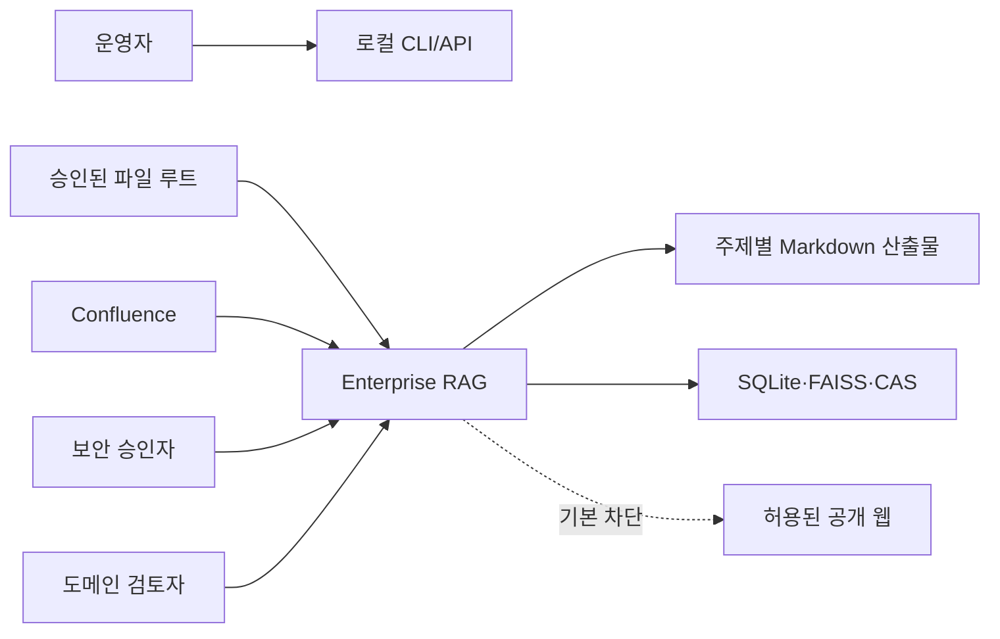
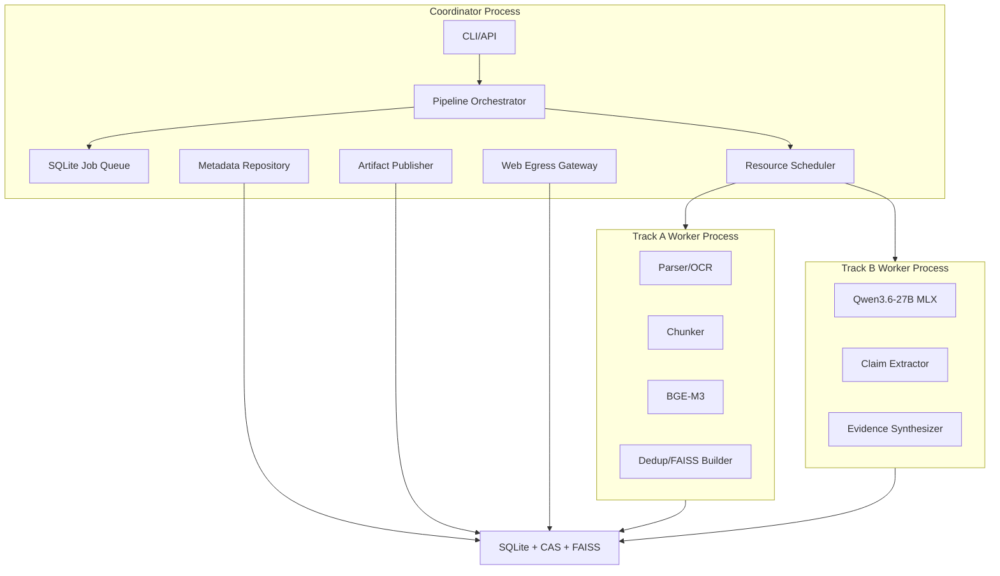
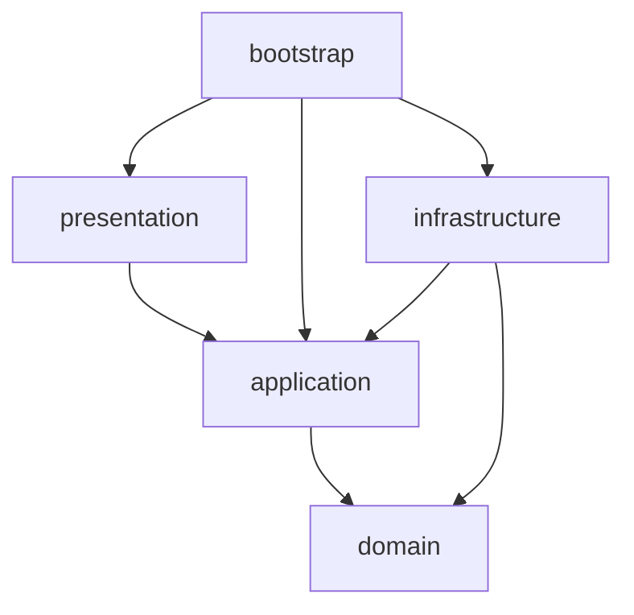
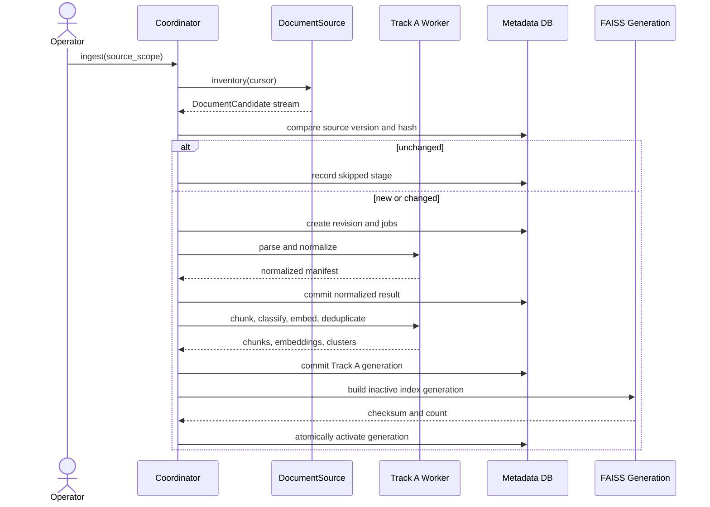
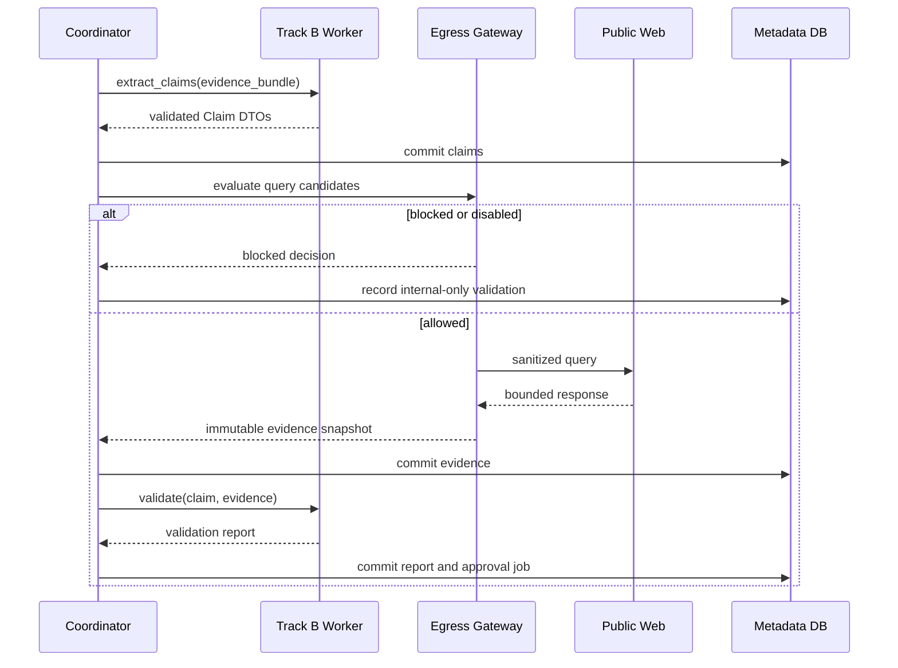
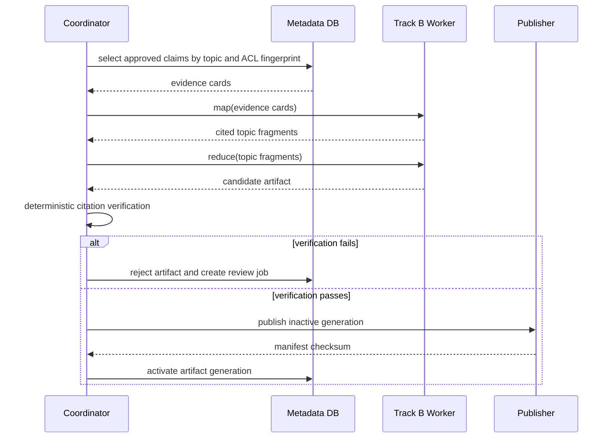

<!-- docs/architecture.md -->
# 시스템 아키텍처 상세 설계

## 1. 아키텍처 목표

이 시스템은 단일 MacBook Pro M4 Max 36GB에서 대량 문서를 증분 처리하면서도 원본 보존, 근거 추적, 보안 격리, 중단 복구를 보장한다. 처리량보다 정확성과 감사 가능성을 우선하며, BGE-M3와 Qwen3.6-27B의 메모리 경쟁을 프로세스와 리스 수준에서 차단한다.

## 2. 시스템 컨텍스트

### 2.1 시스템 내부 책임

- 문서 발견, 스냅샷, 파싱, 정규화, 청킹
- 기술 관련성 분류, 중복 군집, 벡터 인덱싱
- 주장 추출, 선택적 공개 웹 검증, 충돌 탐지
- 승인 관리, 근거 기반 합성, 산출물 게시
- 체크포인트, 재시도, 감사, 메트릭, 백업·복구

### 2.2 시스템 외부 책임

- 소스 시스템의 원본 수명 주기와 원본 ACL 관리
- 외부 웹 정보의 정확성 보장
- 보안 정책과 허용 도메인 승인
- 변경 제안의 업무적 채택 여부 결정
- 생성 산출물의 최종 배포 채널 관리

## 3. 컨테이너와 프로세스 토폴로지

### 3.1 Coordinator Process

Coordinator는 장기 생존 프로세스이며 다음 리소스를 소유한다.

- 설정 스냅샷과 파이프라인 지문
- SQLite 연결 풀의 단일 쓰기 조정자
- 작업 큐, 리스, 체크포인트
- 워커 프로세스 생성·종료·상태 감시
- 외부 HTTP 클라이언트와 egress 정책
- 게시 디렉터리의 원자적 교체
- 구조화 로그와 메트릭 수집

Coordinator는 MLX 또는 BGE 모델을 import하거나 적재하지 않는다. 모델 런타임 오류와 Metal 메모리 단편화가 제어 plane에 전파되지 않도록 한다.

### 3.2 Track A Worker Process

Track A 워커는 파싱과 임베딩 배치를 수행한다. 기본 수명은 작업 배치 단위이며, 유휴 60초 또는 Track B 우선 요청 시 정상 종료한다. 프로세스 종료를 모델 메모리 회수의 최종 보증으로 사용한다.

- 파서 단계는 최대 동시성 2
- OCR 단계는 최대 동시성 1
- BGE 임베딩 단계는 배치 동시성 1
- FAISS 활성 세대를 직접 덮어쓰지 않고 새 세대를 빌드
- Coordinator가 발급한 `ACCELERATOR_TRACK_A` 리스 없이는 BGE 적재 금지

### 3.3 Track B Worker Process

Track B 워커는 Qwen 전용이며 동시 생성 작업은 1개다. `ACCELERATOR_TRACK_B` 리스를 획득한 뒤에만 모델을 로드한다.

- 입력 토큰 수를 런타임 호출 전에 재검증
- 모든 생성 요청에 타임아웃과 취소 ID 부여
- JSON 구조 출력은 스키마 검증 후 최대 1회 교정 재시도
- 작업 사이 프롬프트 상태 공유 금지
- 비정상 종료 시 실행 중 작업은 `retryable_resource_failure`로 회수
- 유휴 120초 후 종료를 기본값으로 사용

### 3.4 외부 웹 접근

외부 웹 접근은 Coordinator의 `WebEgressGateway`만 수행한다. Track B 워커는 검색 쿼리 후보를 반환할 수 있지만 네트워크 권한은 없다. Gateway는 비식별화, 허용 도메인, DNS/IP, 리디렉션, 응답 크기, 콘텐츠 유형을 검증한다.

## 4. 계층과 의존성

### 4.1 허용 규칙

| 발신 계층 | 허용 대상 |
| --- | --- |
| `domain` | Python 표준 라이브러리와 같은 계층 내부 |
| `application` | `domain`, `application` 내부 |
| `infrastructure` | `application` 포트, `domain`, 인프라 라이브러리 |
| `presentation` | `application` DTO와 유스케이스 |
| `bootstrap` | 모든 계층의 조립 지점 |

### 4.2 금지 규칙

- `domain`에서 MLX, PyTorch, FAISS, SQLite, HTTP, 파일 시스템 import 금지
- `application`에서 구체 어댑터 import 금지
- 유스케이스에서 전역 싱글턴, 환경 변수, 현재 시각 직접 참조 금지
- 인프라 어댑터 간 직접 호출 금지
- 프레젠테이션에서 DB·모델·파일 경로 직접 접근 금지
- 모듈 import 시 모델 로드, DB 연결, 네트워크 호출 금지

## 5. 컴포넌트 책임

| 컴포넌트 | 입력 | 출력 | 소유 리소스 |
| --- | --- | --- | --- |
| `InventoryService` | 소스 설정 | 문서 후보 스트림 | 소스 세션 |
| `IngestDocument` | 후보 ID | 리비전과 작업 체인 | 원본 스트림 |
| `StructureAwareChunker` | 정규화 요소 | 청크와 범위 | 토크나이저 |
| `ClassificationPolicy` | 메타·규칙·임베딩 점수 | 3방향 판정 | 없음 |
| `DeduplicationService` | 청크·해시·벡터 | 중복 간선·군집 | 임시 후보 버퍼 |
| `VectorIndexManager` | 임베딩 세대 | 불변 FAISS 세대 | 인덱스 파일 핸들 |
| `ClaimExtractionService` | 우선 청크 | 구조화 주장 | Qwen 세션은 워커가 소유 |
| `WebEgressGateway` | 질의 후보 | 허용 결과 또는 차단 | HTTP 클라이언트 |
| `ValidationService` | 주장·근거 | 검증 보고서·제안 | 없음 |
| `SynthesisService` | 승인된 근거 카드 | 주제 산출물 | Qwen 세션은 워커가 소유 |
| `ArtifactPublisher` | 검증된 임시 산출물 | 활성 산출물 세대 | 임시·활성 디렉터리 |
| `CheckpointManager` | 단계 결과 | 완료 상태·후속 작업 | SQLite 트랜잭션 |

## 6. 런타임 데이터 흐름

### 6.1 증분 인제스천

단계 결과와 후속 작업 생성은 같은 SQLite 트랜잭션에서 커밋한다. FAISS는 파일 시스템에 임시 세대를 만든 뒤 해시와 벡터 수를 검증하고 활성 세대 포인터만 트랜잭션으로 변경한다.

### 6.2 주장 추출과 검증

### 6.3 합성과 게시

## 7. 동시성과 백프레셔

### 7.1 리스 종류

| 리스 | 최대 수 | 상호 배타 관계 | 대상 |
| --- | ---: | --- | --- |
| `ACCELERATOR_TRACK_A` | 1 | `ACCELERATOR_TRACK_B` | BGE-M3 |
| `ACCELERATOR_TRACK_B` | 1 | `ACCELERATOR_TRACK_A` | Qwen3.6-27B |
| `CPU_PARSE` | 2 | 없음 | 텍스트 파서 |
| `CPU_OCR` | 1 | 메모리 경고 시 중지 | OCR |
| `DISK_INDEX_BUILD` | 1 | 백업 작업 | FAISS 세대 생성 |
| `NETWORK_EGRESS` | 2 | 외부 검색 비활성 시 0 | 허용된 웹 요청 |
| `PUBLISH` | 1 | 다른 게시 | 산출물 활성화 |

### 7.2 우선순위

1. 취소와 안전 종료
2. SQLite 커밋과 체크포인트
3. 사용자 요청 Track B 작업
4. 승인 대기 중인 검증 작업
5. 증분 Track A 작업
6. 전체 재인덱싱과 유지보수

### 7.3 메모리 상태

| 상태 | 진입 조건 | 허용 동작 | 복구 조건 |
| --- | --- | --- | --- |
| `NORMAL` | 운영 기준 이내 | 모든 승인된 작업 | 유지 |
| `PRESSURE` | 가용 메모리 6GB 미만 또는 OS 경고 | 새 모델 로드 차단, BGE 배치 절반 | 3회 연속 정상 표본 |
| `CRITICAL` | 가용 메모리 3GB 미만 또는 스왑 급증 | 새 작업 중지, 워커 정상 종료 | 가용 8GB 이상과 스왑 안정 |
| `RECOVERY` | 워커 강제 종료 후 | DB 검증, 작업 회수만 허용 | 일관성 검사 통과 |

메모리 표본 주기는 기본 5초다. 단일 표본으로 상태를 되돌리지 않고 히스테리시스를 적용한다.

## 8. 리소스 소유권과 종료 계약

| 리소스 | 소유자 | 생성 | 정상 종료 | 비정상 종료 대응 |
| --- | --- | --- | --- | --- |
| SQLite writer | Coordinator | 부트스트랩 | WAL 체크포인트 후 close | 재시작 시 무결성 검사 |
| HTTP client | WebEgressGateway | 최초 허용 요청 | 애플리케이션 종료 | 진행 요청 취소 |
| 원본 스트림 | Source adapter | 리비전 스냅샷 | 컨텍스트 종료 | 임시 파일 삭제 |
| 파서 임시 파일 | Track A job | 작업 시작 | 결과 커밋 후 삭제 | 시작 시 고아 정리 |
| BGE 모델 | Track A worker | 가속기 리스 후 | 워커 종료 | 프로세스 회수 |
| Qwen 모델 | Track B worker | 가속기 리스 후 | 워커 종료 | 프로세스 회수 |
| FAISS reader | VectorIndexManager | 세대 활성화 | 세대 교체 후 참조 0일 때 close | 이전 세대 재활성화 |
| 산출물 임시 세대 | Publisher | 게시 시작 | 활성화 후 보존 정책 적용 | 미완료 세대 삭제 |

워커 강제 종료는 정상 취소 유예 15초 후에만 사용한다. 강제 종료된 작업은 성공으로 간주하지 않으며 Coordinator가 리스를 만료하고 작업을 회수한다.

## 9. 실패 경계

| 실패 경계 | 격리 단위 | 전체 실행 영향 |
| --- | --- | --- |
| 소스 연결 | 소스 스코프 | 다른 소스 계속 |
| 문서 파싱 | 문서 리비전 | 해당 리비전 격리 |
| 청크 생성 | 문서 리비전 | 해당 리비전 재시도 또는 격리 |
| 임베딩 | 배치 | 배치 축소 후 재시도 |
| 인덱스 빌드 | 인덱스 세대 | 기존 활성 세대 유지 |
| Qwen 생성 | 요청 | 최대 1회 재시도 후 검토 큐 |
| 외부 검색 | 질의 | 내부 전용 결과 유지 |
| 게시 | 산출물 세대 | 기존 활성 세대 유지 |
| DB 무결성 | 시스템 | 쓰기 중단, 복구 모드 진입 |

## 10. 배포 단위

1차 배포는 단일 호스트, 단일 사용자 운영을 기본으로 한다. 모든 프로세스는 같은 설치 버전과 설정 스냅샷을 사용한다. Coordinator만 외부 인터페이스를 노출하며 워커 IPC는 로컬 전용 Unix Domain Socket 또는 `multiprocessing.connection`으로 제한한다.

API를 활성화할 경우 기본 bind는 `127.0.0.1`이며 인증 없는 외부 bind를 금지한다. 다중 사용자 서비스로 확장할 때는 ACL 주체 인증, Qdrant 전환, 별도 작업 큐, TLS 종료를 새 ADR로 결정한다.

## 11. 아키텍처 검증 규칙

- `import-linter` 또는 동등한 AST 검사로 계층 의존성 위반 0건
- import만으로 외부 I/O가 발생하지 않는 스모크 테스트
- 모든 포트에 최소 하나의 프로덕션 어댑터 또는 명시적 disabled 어댑터 존재
- 모든 리소스 소유 어댑터에 `close` 또는 컨텍스트 관리자 계약 존재
- Coordinator 프로세스에서 `mlx`, `torch`, `faiss` 모델 로드 금지 검사
- 가속기 리스 동시 보유 불가 속성 테스트
- 워커 비정상 종료 후 실행 중 작업과 리스 회수 통합 테스트
- 인덱스와 산출물 활성화 실패 시 이전 세대 유지 시험
