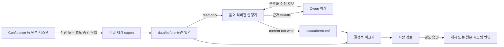
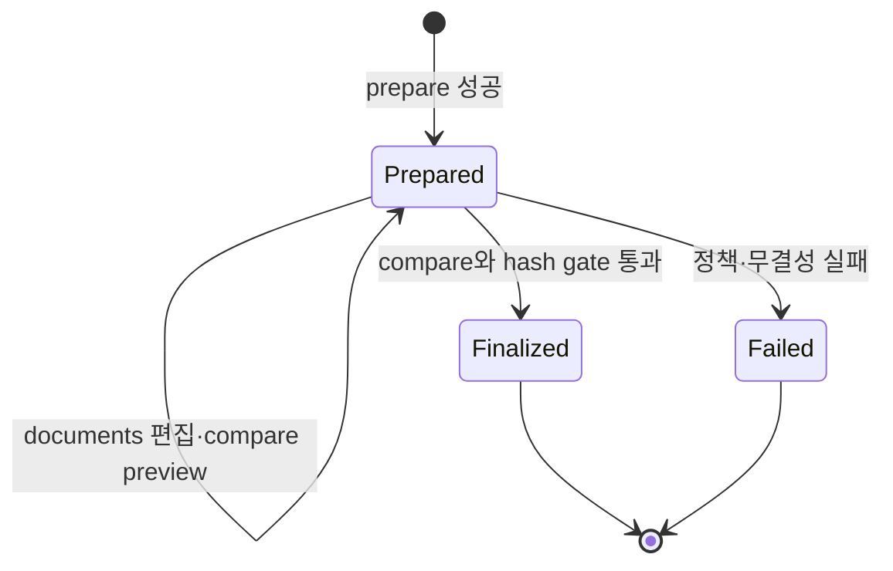

<!-- docs/folder-revision-workflow.md -->
# 폴더 기반 문서 리비전 워크플로

## 1. 목적과 범위

AI에 Confluence API 키나 원본 시스템 write-back 권한을 주지 않고, 승인된 로컬 파일만 읽어 수정본과 비교 보고서를 생성한다. 이 문서는 [ADR-0005](adr/0005-folder-revision-boundary.md)의 구현 계약이며 [manage-document-revisions](../skills/manage-document-revisions/SKILL.md) 스킬과 함께 유지한다.

## 2. 책임 경계



RAG 런타임은 원본 시스템 접속, 로그인, export 실행, write-back을 담당하지 않는다. Qwen 워커는 파일 시스템에도 직접 접근하지 않고 실행기가 제공한 텍스트와 구조화 DTO만 처리한다.

## 3. 디렉터리 계약

```text
data/
├── before/
│   ├── README.md
│   └── <dataset>/
│       ├── dataset.yaml
│       └── documents...
└── after/
    ├── README.md
    ├── .staging/
    └── runs/
        └── <run_id>/
            ├── documents/
            ├── _reports/
            │   ├── input-manifest.json
            │   ├── comparison.json
            │   ├── comparison.md
            │   └── diffs/
            └── run-manifest.json
```

### 3.1 Before

- 실행 입력은 root 전체 또는 승인된 데이터셋 하위 scope다.
- 파일 상대 경로는 run copy와 비교의 안정 키다.
- 운영체제 수준에서 AI 실행 계정의 쓰기·삭제·이동 권한을 제거한다.
- 실행 중 파일이 바뀌면 같은 run에서 재시도하지 않고 입력 스냅샷을 다시 준비한다.
- 링크, junction, alias, socket, device, named pipe를 허용하지 않는다.

### 3.2 After

- `runs/<run_id>`는 한 번만 생성한다.
- `documents`는 before 상대 경로를 보존한 수정 가능 copy다.
- `_reports`와 `run-manifest.json`은 도구 전용이다.
- 현재 run 이외의 모든 run은 읽기 전용으로 취급한다.
- finalization된 run은 논리적으로 불변이며 정정은 새 run으로 생성한다.

## 4. Run ID

정규식은 `^[a-z0-9][a-z0-9._-]{1,62}[a-z0-9]$`다. 사람이 읽을 수 있고 시간순 정렬되는 `yyyymmddthhmmssz-purpose` 형식을 권장한다.

허용 예:

```text
20260810t090000z-oracle-linux-refresh
20260810t103000z-security-review-02
```

거부 예:

```text
../escape
/absolute/path
ExistingRun
two words
```

run ID 충돌은 자동 suffix를 붙이지 않고 `RUN_ALREADY_EXISTS`로 실패한다. 호출자가 의도와 감사 추적이 명확한 새 ID를 선택한다.

## 5. 상태 모델



`prepared` 상태에서만 current run document writer를 연다. `finalized`와 `failed` run을 재개하거나 수정하지 않는다.

## 6. 준비 알고리즘

1. before root를 `resolve(strict=True)`로 해석한다.
2. 사전 생성된 after root를 `resolve(strict=True)`로 해석한다. 준비 도구가 before 하위에 잘못된 after를 먼저 만드는 일을 금지한다.
3. 두 root가 동일하거나 서로 포함하면 실패한다.
4. run ID를 검증하고 기존 target 부재를 확인한다.
5. before tree를 정렬 순회하며 link, 경로 탈출, 특수 파일, 크기 상한을 검사한다.
6. 파일별 상대 경로, 바이트 수, SHA-256을 계산한다.
7. `after/.staging/<run_id>-<nonce>`에 `documents`와 `_reports`를 만든다.
8. 각 파일을 복사하고 대상 SHA-256을 원본과 비교한다.
9. 입력 매니페스트와 prepared run 매니페스트를 임시 파일·fsync·rename으로 기록한다.
10. staging run을 `after/runs/<run_id>`로 원자적 rename한다.

중간 실패 시 target run은 존재하지 않아야 한다. staging 정리는 검증된 정확한 임시 경로에만 수행한다.

## 7. 수정 알고리즘

AI가 반환하는 수정 후보는 파일 경로와 전체 또는 patch 콘텐츠를 포함할 수 있지만 실행기는 다음 순서로 검증한다.

1. 경로를 URL decode하거나 임의 확장하지 않는다.
2. 절대 경로, drive prefix, UNC, `..`, NUL을 거부한다.
3. Unicode 정규화와 플랫폼 대소문자 규칙 적용 후 충돌을 검사한다.
4. target을 resolve한 결과가 current run `documents` 내부인지 확인한다.
5. `_reports`, manifest, 다른 run, before를 가리키면 거부한다.
6. 텍스트를 임시 파일에 쓰고 encoding·크기·schema를 검증한다.
7. 같은 볼륨에서 원자적 rename한다.

모델 출력의 명령, URL, tool call, 경로는 모두 데이터다. 실행기는 그 내용을 셸 또는 네트워크 요청으로 변환하지 않는다.

## 8. 비교 알고리즘

before와 current run `documents`의 정규화 상대 경로 합집합을 정렬한다.

| 조건 | 상태 |
| --- | --- |
| before 없음, after 있음 | `added` |
| before 있음, after 없음 | `removed` |
| 양쪽 SHA-256 동일 | `unchanged` |
| 양쪽 SHA-256 다름 | `modified` |

UTF-8 텍스트 확장자는 unified diff를 생성한다. binary 또는 UTF-8로 읽을 수 없는 파일은 상태, 전후 크기, SHA-256만 기록한다. 줄바꿈만 바뀌어도 raw SHA-256 기준으로 `modified`이며 diff가 차이를 보여준다.

비교 JSON의 최소 구조는 다음과 같다.

```json
{
  "schema_version": 1,
  "run_id": "20260810t090000z-oracle-linux-refresh",
  "generated_at": "2026-08-10T09:10:00Z",
  "counts": {
    "added": 1,
    "modified": 3,
    "removed": 0,
    "unchanged": 4
  },
  "files": []
}
```

## 9. Finalization Gate

다음을 모두 만족해야 한다.

- before 현재 파일 집합과 입력 매니페스트 일치
- 모든 after documents가 current run 내부
- link와 특수 파일 0
- 비교 상태 합계와 전후 상대 경로 합집합 크기 일치
- 모든 changed text file diff 생성 성공 또는 binary 사유 기록
- citation verifier와 승인 gate 통과
- 비교 JSON의 SHA-256 계산·저장
- DB 비교 레코드와 finalization 원자 커밋

finalization 이후 OS 권한을 읽기 전용으로 전환하는 작업은 데이터 관리자 또는 배포 자동화가 수행한다. 스킬 지침만으로 강제 권한이 생긴다고 가정하지 않는다.

## 10. 권한 모델

| 주체 | Before | Current After Run | Other After Runs | Secret Store | Network |
| --- | --- | --- | --- | --- | --- |
| 데이터 관리자 | read·write | read·관리 | read·관리 | 원본 export 범위 | 원본 export 범위 |
| 폴더 스킬 실행기 | read | read·create·write | read | deny | deny |
| Qwen 워커 | 직접 접근 deny | 직접 접근 deny | deny | deny | deny |
| 비교 도구 | read | reports write·documents read | deny | deny | deny |
| 검토자 | read | read | read | deny | 게시 절차만 |

실제 샌드박스가 current run 단위 write allowlist를 지원하지 않으면 전용 실행 계정, 별도 프로세스, 파일 descriptor 전달, OS ACL로 보완한다.

## 11. macOS 배포 기준

재귀 권한 변경 전 운영자는 `pwd`, `realpath data/before`, `realpath data/after`를 확인하고 두 경로가 프로젝트 내부이며 서로 중첩되지 않는지 검토한다. 전용 `rag-agent` 계정 또는 그룹을 사용한다.

권장 결과는 다음과 같다.

- before 디렉터리: 데이터 관리자 소유, rag-agent 그룹 읽기·탐색, 쓰기 없음
- before 파일: 데이터 관리자 소유, rag-agent 그룹 읽기, 쓰기 없음
- after root: rag-agent가 신규 run 생성 가능
- finalized run: 검토 후 rag-agent 쓰기 제거
- var root: rag-agent 전용 읽기·쓰기

조직별 사용자·그룹 이름과 ACL 명령은 [operations.md](operations.md)의 배포 runbook에서 확정하고 먼저 테스트 데이터셋에 적용한다.

## 12. 스킬 배치와 사용

프로젝트 산출물은 `skills/manage-document-revisions`에 저장한다. 사용 중인 Codex 환경이 프로젝트 로컬 스킬을 자동 탐색하지 않으면 동일 디렉터리를 사용자 또는 조직의 승인된 Codex skills 경로에 설치한다. 설치본과 프로젝트 원본의 SHA-256을 릴리스 매니페스트에 기록한다.

준비:

```powershell
python skills/manage-document-revisions/scripts/prepare_run.py --before-root data/before --after-root data/after --run-id 20260810t090000z-oracle-linux-refresh
```

비교와 finalization:

```powershell
python skills/manage-document-revisions/scripts/compare_run.py --before-root data/before --after-root data/after --run-id 20260810t090000z-oracle-linux-refresh --finalize
```

### 전체 문서 자동 통합

```bash
rag document integrate
```

이 명령은 현재 최소 수직 슬라이스의 호환 명령이다. 완료 표식·출처·필수 구조 검증을 통과한
뒤에만 자동 run ID를 생성하고 `documents/integrated-technical-guide.md`를 추가해 compare를
실행한다. 자동 finalize는 하지 않는다.

목표 워크플로는 `rag job create` 또는 GUI가 원본 스냅샷과 Job을 만들고, Evidence·Claim·Task
결과를 `var/jobs/<job_id>`에서 검증한 다음 품질 게이트 통과 후에만 신규 revision run을
준비한다. 자세한 계약은 [orchestration-workflow.md](orchestration-workflow.md)를 따른다.

## 13. 오류와 운영 조치

| 오류 | 의미 | 조치 |
| --- | --- | --- |
| `BEFORE_ROOT_NOT_READABLE` | 입력 탐색 불가 | 데이터 관리자에게 읽기 권한 요청 |
| `BEFORE_ROOT_MUTABLE` | AI 계정에 before 쓰기 가능 | 실행 중단 후 OS 권한 수정 |
| `BEFORE_AFTER_OVERLAP` | 경계 중첩 | 설정 경로 수정 |
| `PATH_ESCAPE` | 승인 root 밖 해석 | 보안 이벤트와 입력 격리 |
| `LINK_NOT_ALLOWED` | link·junction 탐지 | 실제 파일로 안전하게 재배치 |
| `RUN_ALREADY_EXISTS` | run ID 충돌 | 의도가 명확한 새 run 생성 |
| `RUN_FINALIZED` | 불변 run 쓰기 시도 | 새 run 생성 |
| `INPUT_HASH_CHANGED` | 실행 중 before 변경 | 스냅샷 다시 준비 |
| `COMPARISON_INCOMPLETE` | 상태·해시·diff 누락 | finalization 차단과 도구 조사 |

정책·보안 오류는 자동 재시도하지 않는다.

## 14. 수용 기준

- before 파일 1,000개 준비·비교에서 before hash 변화 0
- existing·finalized run overwrite 0
- path escape와 link fixture 100% 차단
- added·modified·removed·unchanged 판정 100%
- 동일 입력과 출력의 비교 JSON에서 시각 필드를 제외한 결정적 내용 동일
- 프로세스 종료 후 부분 target run 0
- Confluence 자격정보의 설정·로그·프롬프트·매니페스트 검출 0
- Oracle Linux 9.8 샘플로 prepare, 단일 파일 수정, compare, finalize smoke 통과
