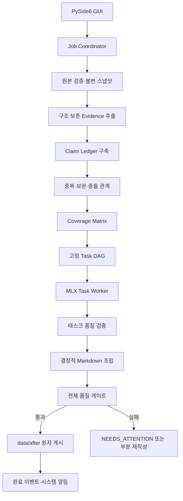

<!-- docs/orchestration-workflow.md -->
# Evidence 기반 문서 오케스트레이션과 GUI 워크플로

## 1. 범위

이 문서는 [ADR-0006](adr/0006-evidence-ledger-orchestration.md)을 구현하는 Coordinator, Job,
Evidence, Claim Ledger, Coverage Matrix, Task, 품질 게이트와 로컬 GUI 계약을 정의한다.

## 2. 전체 흐름



## 3. 저장 영역

| 영역 | 내용 | 최종 사실 근거 |
| --- | --- | --- |
| Evidence | 원본 구조 요소, 청크, 표, 명령과 출처 좌표 | 허용 |
| Derived | 개요, 기존 산출물, 태스크 초안과 검토 의견 | 금지 |
| Control | Claim, 관계, Coverage, Task, Job 이벤트 | 금지 |

최종 출처는 Evidence ID에서 입력 스냅샷의 실제 상대 경로와 SourceSpan까지 역추적돼야 한다.

## 4. Job 상태 머신

정상 상태 전이는 다음과 같다.

```text
CREATED -> INSPECTING -> SNAPSHOTTING -> EXTRACTING_EVIDENCE
-> BUILDING_CLAIMS -> PLANNING -> RUNNING_TASKS -> VALIDATING_TASKS
-> ASSEMBLING -> VALIDATING_FINAL -> PUBLISHING -> COMPLETED
```

분기 상태는 `NEEDS_ATTENTION`, `CANCELLING`, `CANCELLED`, `FAILED`다. 완료·실패·취소는
terminal 상태이며 다른 실행 상태로 되돌릴 수 없다. `NEEDS_ATTENTION`은 명시적인 재개 요청이
있을 때 실패 태스크 실행 또는 최종 조립 단계로만 전이한다.

## 5. Job 아티팩트

```text
var/jobs/<job_id>/
├── job.json
├── definition.json
├── source-manifest.json
├── evidence/index.json
├── control/claim-ledger.json
├── control/task-plan.json
├── tasks/<task_id>/attempt-001/output.json
├── tasks/<task_id>/attempt-001/validation.json
├── derived/assembled-draft.md
├── control/final-validation.json
├── control/publish-result.json
├── control/completion-notification.json
├── runner-state.json
├── .runner-state.lock
├── .runner.lock
└── runner.log
```

상태·진행 이벤트는 파일이 아니라 SQLite에 순서 번호와 함께 저장한다. 각 구조화
아티팩트는 schema version과 Job ID를 포함하고, 입력·파이프라인 hash로 같은 실행의
결과임을 재검증한다. 완료된 아티팩트는 in-place로 수정하지 않고 새 attempt를 기록한다.

`publish-result.json`은 최종 문서, 비교 JSON·Markdown과 합성 보고서의 SHA-256을 보존한다.
`completion-notification.json`은 게시 fingerprint별 알림 선점·전달 결과를 기록하는 가변 운영
영수증이며 별도 파일 lock 아래에서만 갱신한다.

`runner-state.json`은 체크포인트가 아니라 프로세스 관측용 가변 상태다. launcher가 Job별
`.runner.lock`을 먼저 획득하고 새 runner token과 launch sequence를 기록한다. 자식 Worker는
같은 lock descriptor를 상속한 뒤 token·PID를 claim하고 실행 중 주기적으로 heartbeat를
원자 갱신한다. 정상 종료와 오류 종료는 각각 `EXITED`, `FAILED`로 기록하며, 비정상 종료로
heartbeat가 3회 누락되면 Dashboard가 `STALE`로 판정한다. 다음 실행은 OS가 해제한
`.runner.lock`을 획득한 경우에만 이전 stale 관측 상태를 새 sequence로 교체할 수 있다.

## 6. Claim과 중복 관계

Claim은 최소 `claim_id`, `kind`, `statement`, `evidence_ids`, `preconditions`, `commands`,
`warnings`를 가진다. 관계 판정은 임베딩 유사도만으로 확정하지 않는다.

| 관계 | 조립 정책 |
| --- | --- |
| `EXACT_DUPLICATE` | 하나로 병합하고 모든 Evidence 유지 |
| `SEMANTIC_EQUIVALENT` | 표현 통합, 적용 범위 차이는 보존 |
| `COMPLEMENTARY` | 같은 절차의 순서 또는 하위 항목으로 결합 |
| `CONTEXTUAL_REPEAT` | 서로 다른 운영 단계에 각각 유지 |
| `CONFLICT` | 두 주장을 충돌 항목으로 함께 게시 |
| `UNRELATED` | 별도 유지 |

## 7. Coverage와 Task 계획

원본의 모든 구조 요소는 최소 하나의 Task에 배정한다. 필수 Claim은 정확히 하나의 소유 Task와
0개 이상의 참조 Task를 가진다. 계획이 고정된 뒤 전체 Task 수와 검증 수를 변경하지 않는다.

TaskPacket은 목적, 필수 Claim ID, 허용 Evidence ID, 중복 관계, 필수 섹션, 출력 스키마를
포함한다. 모델은 다른 Task의 결과나 자유 검색 결과를 사실 근거로 사용할 수 없다.

## 8. 검증과 조립

태스크 검증은 완료 표식, 스키마, 필수 Claim, 출처, 명령·전제조건·경고·롤백 보존을 검사한다.
결정적 검증 실패는 모델이 우회할 수 없다. 의미 검증 실패는 동일 Evidence를 고정한 채 해당
섹션만 최대 2회 재작성한다.

Assembler는 검증된 섹션, 제목, 목차, 출처, 원본 목록을 코드로 조립한다. 전체 문서를 모델에
다시 전달하지 않는다.

## 9. 품질 게이트

| 항목 | 기준 |
| --- | ---: |
| 필수 Coverage | 100% |
| 출처와 Evidence 연결 | 100% |
| 원본 구조 요소 배정 | 100% |
| 잘린 출력·미완성 Markdown | 0건 |
| 근거 없는 사실·숨겨진 충돌 | 0건 |
| 필수 경고·롤백·원본 누락 | 0건 |

게이트를 통과하기 전에는 FolderRevisionWorkspace를 준비하지 않는다.

## 10. 진행 이벤트

Task DAG 확정 전에는 단계별 건수와 `분석 중` 상태를 표시한다. 계획 확정 후에는 전체 작업량을
고정하고 진행률이 감소하지 않게 한다.

```json
{
  "job_id": "job-...",
  "sequence": 42,
  "stage": "RUNNING_TASKS",
  "message": "보안 강화 태스크 생성 중",
  "counter_name": "tasks",
  "completed": 4,
  "total": 7,
  "overall_percentage": 61,
  "occurred_at": "2026-08-12T10:30:00Z"
}
```

이벤트에는 원문, 모델 출력 전문, 비밀값을 기록하지 않는다.

## 11. GUI 계약

GUI는 별도 V2를 만들지 않고 기존 `presentation` 계층에 PySide6 기반 로컬 프로세스로 통합하며
Application 유스케이스만 호출한다. 상세 화면 계약은 [desktop-gui.md](desktop-gui.md)를 따른다.

1. `설정` 탭에서 원본·결과 폴더, 고정 모델 revision, 추가 시스템 지침과 실행 정책 관리
2. `실행` 탭에서 Job 생성·시작·취소·재개
3. 원본·Evidence·Claim·Task 계획과 품질 상태 검토
4. 단계별 완료/전체 건수, 현재 태스크, 경과 시간과 event sequence 표시
5. 체크포인트별 저장·무결성·재개 가능 상태 표시
6. 완료·검토 필요·실패 결과와 보고서 표시

MLX Worker는 별도 프로세스가 소유한다. GUI를 닫았다 다시 열어도 SQLite Job과 Event를 읽어
상태를 복원한다. 시스템 완료 알림은 게시 파일과 매니페스트가 모두 커밋된 뒤 발생한다.

## 12. 취소와 복구

취소 요청은 Job을 `CANCELLING`으로 원자 전이한다. Worker는 현재 MLX 호출이 끝나는
안전 경계에서 새 이벤트를 기록하지 않고 `CANCELLED`로 확정한다. 검증된 이전 Task
결과는 보존한다. 재개 시 입력 스냅샷 해시와 파이프라인 지문이 같을 때만 완료
Task와 유효한 attempt를 재사용한다. 단계 완료 event까지 commit된 경우 다음 단계로
이동하고, event 전에 중단된 멱등 단계는 저장된 아티팩트를 재검증한다.
