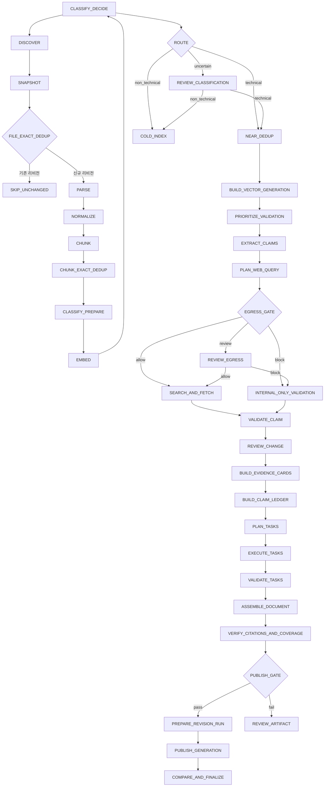

<!-- docs/pipeline.md -->
# Two-Track 파이프라인 상세 설계

## 1. 단계 DAG



`CREATE_JOB`, `PLAN_TASKS`, 품질 게이트, `PREPARE_REVISION_RUN`, 게시,
`COMPARE_AND_FINALIZE`는 Coordinator가 수행한다. Track A는 `DISCOVER`부터
`BUILD_VECTOR_GENERATION`까지고 Track B는 Claim 추출, Task 실행과 의미 검증을 수행한다.
게시 run은 품질 게이트 통과 후에만 준비한다.

## 2. 공통 단계 계약

모든 단계는 다음 필드를 가진다.

| 필드 | 의미 |
| --- | --- |
| `stage_name` | 고정 Enum |
| `target_type` | source, document, revision, chunk_batch, claim, topic, generation |
| `target_id` | 대상 안정 ID |
| `pipeline_fingerprint` | 실행 시 고정된 지문 |
| `idempotency_key` | 단계·대상·지문 SHA-256 |
| `input_manifest` | 입력 ID와 해시 목록 |
| `output_manifest` | 출력 ID와 해시 목록 |
| `attempt` | 1부터 시작하는 실행 횟수 |
| `deadline_at` | 단계 제한 시각 |

단계는 입력을 수정하지 않고 새 파생 레코드를 만든다. 성공은 결과가 저장되고 다시 검증될 수 있을 때만 반환한다.

## 3. Track A 단계

### 3.1 `DISCOVER`

입력은 GUI 또는 CLI에서 승인한 source root, 데이터셋 scope, cursor다. 출력은
`DocumentCandidate` 페이지와 다음 cursor다. 시작 전에 Job과 `var/jobs/<job_id>` 입력
스냅샷 영역이 준비돼 있어야 하며 after run은 아직 만들지 않는다.

처리 규칙:

1. source adapter가 제공한 안정 키로 후보를 정렬한다.
2. 페이지별 후보 수는 기본 100이다.
3. 후보를 DB에 upsert하고 각 변경 후보에 `SNAPSHOT` 작업을 만든다.
4. `UNCHANGED` 힌트는 최적화일 뿐이며 소스 버전이나 ACL fingerprint가 다르면 스냅샷한다.
5. 소스에서 사라진 external key는 `DELETED_AT_SOURCE`로 표시하되 기존 리비전을 유지한다.

완료 기준은 cursor와 후보 배치가 같은 트랜잭션에 기록되는 것이다.

### 3.2 `SNAPSHOT`

1. 승인된 소스 객체를 streaming read한다.
2. 최대 파일 크기 기본값 2GiB를 읽기 전에 검사하고 미확정 크기는 스트림 상한으로 제한한다.
3. 읽으면서 SHA-256과 바이트 수를 계산한다.
4. 읽기 전후 소스 버전, 파일 크기, 수정 시각을 비교한다.
5. 값이 달라지면 결과를 폐기하고 `SOURCE_BUSY`로 재시도한다.
6. MIME은 선언값, 확장자, magic bytes를 비교한다.
7. CAS 저장과 해시 재검증 후 리비전 후보를 반환한다.

암호화, 손상, 미지원 파일은 아직 파싱하지 않았으므로 이 단계에서는 `detected_mime_type`과 안전한 메타데이터만 기록한다.

### 3.3 `FILE_EXACT_DEDUP`

판정 키는 `content_sha256 + ACL fingerprint + source_version`이다.

- 같은 문서의 동일 키가 존재하면 `SKIP_UNCHANGED`다.
- 다른 문서가 같은 콘텐츠를 가리키면 새 document location과 revision을 유지하고 CAS 객체만 재사용한다.
- ACL이 다르면 동일 콘텐츠라도 별도 revision을 만든다.
- 소스 버전이 바뀌었지만 콘텐츠와 ACL이 같으면 새 revision을 만들고 이전 revision과 exact lineage를 연결한다.

### 3.4 `PARSE`

파서 선택 순서:

1. detected MIME과 정확히 일치하는 전용 파서
2. 선언 MIME과 확장자가 일치하고 magic bytes가 호환되는 파서
3. 지원 없음으로 격리

PDF OCR 결정은 페이지별 텍스트 문자 수, 비공백 비율, 유효 유니코드 비율을 이용한다. 초기 후보 기준은 페이지당 정규화 문자 80자 미만 또는 유효 문자 비율 0.6 미만이다. 기준은 골든 세트로 보정하며 전체 PDF가 아니라 해당 페이지만 OCR한다.

파서 출력은 정규화 전 구조 요소와 경고를 포함한다. 스크립트, 스타일, 매크로, 외부 개체 실행은 금지한다.

### 3.5 `NORMALIZE`

고정 순서:

1. Unicode NFC 정규화
2. `CRLF`와 `CR`을 `LF`로 통일
3. 제어 문자 제거와 탭 보존 정책 적용
4. 반복 공백 정리
5. 헤더·푸터 후보 표시
6. 제목 경로 계산
7. 표와 코드 블록 직렬화
8. 요소별 source span 검증
9. normalized JSON 저장

원문 표시는 변경하지 않고 `display_text` 생성 규칙에만 정규화를 적용한다. 코드 블록 내부 공백과 줄바꿈은 보존한다. 표는 셀 좌표를 잃지 않는 구조 JSON과 검색용 직렬화 텍스트를 모두 가진다.

### 3.6 `CHUNK`

#### 3.6.1 기본 예산

| 항목 | 값 |
| --- | ---: |
| 목표 토큰 | 800 |
| 최대 토큰 | 1200 |
| 중첩 비율 | 0.12 |
| 최소 의미 청크 | 80토큰 |
| 제목 prefix 상한 | 120토큰 |

#### 3.6.2 경계 우선순위

1. 최상위 제목 전환
2. 하위 제목 전환
3. 문단 경계
4. 목록 항목 그룹
5. 문장 경계
6. 토큰 경계

표와 코드 블록은 최대 토큰 이하이면 분할하지 않는다. 초과하면 행, 함수·클래스, 빈 줄 경계를 사용한다. 그래도 분할할 수 없으면 `ChunkBoundaryError`로 격리하지 않고 검토 큐에 보낸다.

#### 3.6.3 중첩

- 중첩은 이전 청크의 마지막 완전 문장 또는 요소 단위로만 생성한다.
- 제목 prefix는 중첩 토큰에 포함하지 않는다.
- 표와 코드 청크에는 기본 중첩을 적용하지 않고 상위 컨텍스트 ID를 연결한다.
- 중첩 텍스트의 source span은 원래 좌표를 재사용한다.

### 3.7 `CHUNK_EXACT_DEDUP`

같은 `content_sha256` 청크를 exact duplicate edge로 연결한다. 삭제하거나 임베딩을 건너뛸 수는 있지만 다음 조건을 지킨다.

- 첫 임베딩 레코드를 재사용할 때 모델·리비전·embedding text 해시가 같아야 한다.
- 제목 prefix가 다르면 display text가 같아도 embedding text가 다를 수 있으므로 별도 임베딩한다.
- 모든 source span과 문서 위치를 유지한다.

### 3.8 `CLASSIFY_PREPARE`

#### 3.8.1 메타데이터 점수

승인된 규칙 파일에서 데이터셋, 상대 경로, 태그, 작성 부서를 읽는다. 규칙별 가중치는 0~1이며 여러 규칙은 `1 - product(1 - score_i)`로 결합한다.

#### 3.8.2 규칙 점수

코드 fence, 셸 명령, semver, 패키지 좌표, API path, 설정 키, 기술 용어를 특징으로 사용한다. 원문을 수정하지 않고 특징 존재와 밀도만 계산한다.

#### 3.8.3 중심점

라벨 데이터의 기술·비기술 청크를 같은 BGE 리비전으로 임베딩하고 L2 정규화 평균 후 다시 정규화한다. 중심점 매니페스트에는 데이터셋 버전, 모델 리비전, 샘플 수, 해시를 기록한다.

### 3.9 `EMBED`

1. `embedding_text`와 모델 토크나이저 상한을 검사한다.
2. 기본 배치 8로 시작한다.
3. 출력 개수, item ID 순서, 차원, 유한값을 검사한다.
4. 벡터 L2 norm이 허용 오차 0.999~1.001인지 확인한다.
5. OOM이면 배치를 4, 2, 1로 축소한다.
6. 배치 1에서도 OOM이면 resource pressure 실패로 처리한다.
7. 임베딩 staging과 레코드를 배치 단위 커밋한다.

### 3.10 `CLASSIFY_DECIDE`

초기 점수 결합식은 골든 세트 보정 전까지 운영에서 활성화하지 않는다. 평가를 위한 후보식은 다음과 같다.

```text
semantic_margin = clamp((technical_similarity - nontechnical_similarity + 1) / 2, 0, 1)
aggregate = 0.20 * metadata_score + 0.20 * rule_score + 0.60 * semantic_margin
```

임계값은 `technical_threshold`와 `non_technical_threshold` 두 개다.

```text
aggregate >= technical_threshold -> technical
aggregate <= non_technical_threshold -> non_technical
otherwise -> uncertain
```

문서 수준 판정은 청크 점수의 상위 20% trimmed mean, 제목 청크 최대값, technical 청크 비율을 사용한다. 문서가 technical이면 모든 청크를 자동 technical로 바꾸지 않고 각 청크 판정을 유지한다.

### 3.11 `REVIEW_CLASSIFICATION`

검토자는 technical 또는 non_technical을 선택하고 이유 코드를 기록한다. 결정은 라벨 데이터 후보로 축적하지만 현재 모델 중심점을 자동 변경하지 않는다. 다음 평가 데이터 버전에서 승인된 라벨만 반영한다.

### 3.12 `NEAR_DEDUP`

#### 3.12.1 후보 생성

1. 같은 언어와 유사 토큰 길이 구간으로 분리
2. 5-gram MinHash LSH로 near text 후보 생성
3. FAISS top 20으로 semantic 후보 생성
4. 같은 문서 인접 중첩 청크는 별도 `overlap` 관계로 제외

#### 3.12.2 판정 순서

| 조건 | 관계 |
| --- | --- |
| 콘텐츠 해시 동일 | `exact` |
| MinHash 기준 통과, 의미 점수 기준 통과 | `near_text` |
| MinHash 기준 미달, 의미 점수 고기준 통과 | `semantic` |
| 경계 구간 | `review_required` |
| 버전·수치·부정 표현 충돌 탐지 | `conflict` |

임계값은 설정에서 `null`이면 운영 군집을 만들지 않고 점수 리포트만 생성한다. 숫자, 버전, 날짜, `not`, `제외`, `금지`, `미지원` 같은 극성 토큰이 다르면 자동 정규본 병합을 금지한다.

#### 3.12.3 군집

확정 duplicate edge의 연결 요소로 군집을 만든다. semantic edge의 transitive closure가 의미 변질을 일으킬 수 있으므로 각 신규 멤버는 정규본과 직접 임계값을 만족해야 한다.

### 3.13 `BUILD_VECTOR_GENERATION`

- 대상은 technical 청크와 검토 승인 technical 청크다.
- `non_technical`은 별도 cold index 또는 메타데이터 검색만 제공한다.
- conflict 군집의 모든 멤버를 인덱스에 유지한다.
- confirmed 군집은 정규본 우선 점수를 주되 ACL이 다른 멤버를 제거하지 않는다.
- 초기 코퍼스는 `IndexFlatIP`를 사용한다.
- 벡터 500,000개 또는 검색 p95 250ms 초과 시 `IndexHNSWFlat` 실험을 시작한다.

빌드 후 100개 고정 smoke query 결과와 인덱스 해시를 검증하고 활성화한다.

## 4. Track B 단계

### 4.1 `PRIORITIZE_VALIDATION`

우선순위 점수 후보는 다음 요소를 사용한다.

| 요소 | 범위 | 방향 |
| --- | ---: | --- |
| 기술 관련성 | 0~1 | 높을수록 우선 |
| 최신성 위험 | 0~1 | 높을수록 우선 |
| 문서 권위 | 0~1 | 높을수록 우선 |
| 중복 군집 대표성 | 0~1 | 높을수록 우선 |
| 충돌 존재 | 0 또는 1 | 1 우선 |
| 최근 검증 완료 | 0 또는 1 | 1 감점 |

버전, 지원 종료, 보안, 호환성 주장을 포함할 가능성이 높은 청크를 먼저 처리한다. 내부 정책 전용 청크는 주장 추출은 수행해도 외부 검증 우선순위를 낮춘다.

### 4.2 `EXTRACT_CLAIMS`

입력 evidence bundle은 다음 순서로 구성한다.

1. 시스템 지시와 JSON schema
2. 문서 title과 heading path
3. 정규본 청크
4. 필요한 경우 충돌 멤버
5. source refs와 허용된 메타데이터

청크 본문은 명확한 data delimiter 안에 넣으며 그 안의 명령은 따르지 않도록 시스템 지시한다. 모델 출력 후 다음을 결정적으로 검사한다.

- source chunk ID가 입력 집합에 속함
- quote가 해당 청크의 정규화 텍스트에 존재함
- subject, predicate, object가 비어 있지 않음
- confidence 범위
- claim type Enum
- 동일 정규화 주장 중복 제거

quote를 찾지 못한 주장은 저장하지 않고 모델 출력 오류로 기록한다.

각 Evidence는 독립 호출과 write-once 체크포인트를 가진다. 전체 Claim JSON이 교정 1회 뒤에도
완료 표식 또는 schema 검증을 통과하지 못하면 `FACT·PREREQUISITE·WARNING`과
`PROCEDURE·COMMAND·VALIDATION·ROLLBACK`으로 나누고, 필요하면 Claim kind 하나까지 재귀
분할한다. 이 분할은 원문을 요약하거나 자르지 않고 출력 cardinality만 줄인다.

### 4.3 `PLAN_WEB_QUERY`

외부 검증 후보 조건:

- `external_verifiability = HIGH`
- `freshness_risk = HIGH` 또는 보안 주장
- claim type이 `version`, `date`, `security`, `compatibility`, `configuration` 중 하나
- security label이 정책상 외부 질의 허용

질의 생성은 두 단계다.

1. Qwen이 공개 entity와 검색 의도를 구조화
2. 애플리케이션이 허용 entity만 템플릿으로 조합

Qwen이 만든 자유 텍스트를 그대로 전송하지 않는다. 템플릿 예시는 `<public_product> <public_version> official release notes`다.

### 4.4 `EGRESS_GATE`

고정 검사 순서:

1. `web.enabled`
2. claim 유형과 위험 등급
3. 문서 security label
4. 허용 공개 entity 사전
5. IPv4, IPv6, CIDR, hostname, email, URL, 고객명, 코드명, 저장소명, 토큰 패턴
6. transmitted query 재구성
7. 허용 도메인 결정
8. audit event 생성

민감 패턴이 하나라도 남으면 `ALLOW`할 수 없다. 자동 제거가 의미를 바꾸면 `REVIEW`, 그렇지 않으면 `BLOCK`이다.

### 4.5 `SEARCH_AND_FETCH`

- 검색 결과 기본 상한 5개
- 공식 제품 문서와 릴리스 노트 우선
- 동일 canonical URL은 한 번만 fetch
- connect 5초, total 20초
- 리디렉션 최대 3회
- 압축 해제 후 본문 최대 5MiB
- HTML, text, PDF만 허용
- JavaScript 실행 금지
- DNS 결과가 public IP인지 매 리디렉션에서 검사
- robots와 조직 정책을 적용

근거 본문은 main content 추출 후 CAS에 저장한다. 스니펫과 본문이 불일치하면 본문을 기준으로 한다.

### 4.6 `VALIDATE_CLAIM`

Qwen 입력은 주장, 내부 quote, 외부 evidence quote, 발행 주체, 게시·수집 시각만 포함한다. 출력은 `relation`, 세 상태 필드, evidence별 support relation, confidence다.

결정적 후처리:

- 외부 근거가 없으면 `CONFIRMED`, `OUTDATED`, `CONTRADICTED` 금지
- `published_at`이 없으면 최신성 비교에 사용 금지
- 제품 major version 또는 배포 채널이 다르면 `NOT_APPLICABLE` 후보
- 두 primary source가 충돌하면 `requires_human_review = true`
- 보안 주장은 confidence와 무관하게 사람 검토 필요

### 4.7 `REVIEW_CHANGE`

검토 화면은 원문 수정 UI가 아니라 다음 정보를 나란히 제공한다.

- 내부 주장과 정확한 출처 범위
- 공개 상태와 URL·발행 시각·수집 시각
- 관계 판정과 confidence
- 제안 변경, 적용 조건, 영향, 위험
- 모델·프롬프트·실행 ID

승인, 기각, 보류 모두 사유가 필수다. 승인된 제안도 원본을 수정하지 않고 합성 입력 상태만 바꾼다.

## 5. 합성 단계

### 5.1 `BUILD_EVIDENCE_CARDS`

근거 카드 구조:

```json
{
  "schema_version": 1,
  "topic_key": "backend/java/spring",
  "acl_fingerprint": "64-hex",
  "claim_id": "sha256:...",
  "status": "approved_internal|approved_external|conflict",
  "statement": "string",
  "internal_quotes": [],
  "external_quotes": [],
  "applicability": "string",
  "confidence": 0.0
}
```

카드는 같은 topic과 ACL fingerprint 안에서만 묶는다. 승인되지 않은 외부 변경은 `approved_external`이 될 수 없다.

### 5.2 토픽 결정

우선순위:

1. 사내 공식 taxonomy mapping
2. 소스 태그와 제목 경로
3. 승인된 규칙 기반 분류
4. 임베딩 계층 군집 제안
5. `unclassified/<stable-id>`

군집이 기존 공식 taxonomy와 충돌하면 taxonomy를 우선하고 군집은 관련 토픽 링크로만 사용한다.

### 5.3 `MAP_SYNTHESIS`

이 단계는 `BUILD_CLAIM_LEDGER`로 대체한다. Evidence의 사실, 절차, 명령, 전제조건, 경고,
검증, 롤백을 원자 Claim으로 추출한다. 모든 Claim은 하나 이상의 Evidence ID를 가져야 한다.
Derived 산출물은 중복 후보 탐색에는 사용할 수 있지만 Evidence ID가 될 수 없다.

Claim 관계는 exact·lexical·command fingerprint·embedding으로 후보를 만든 뒤 구조화된 의미
판정으로 확정한다. 임베딩 점수만으로 Claim을 삭제하거나 병합하지 않는다.

현재 로컬 수직 슬라이스의 후보 recall은 원본 경로, 전체 문장 순서, kind, token inverted block,
character 3-gram MinHash view를 합쳐 확보한다. 입력 초과와 불완전 relation JSON은 모두 최대
40 Claim의 겹침 batch로 전환한다. 관계 출력은 compact Claim ref 튜플을 사용하며, 잘린 batch는
내부 쌍과 LEFT-RIGHT 교차 쌍으로 손실 없이 재귀 분할한다. 의미 동등 쌍도
kind·전제조건·명령·경고가 모두 같을 때만 한 Claim으로 접고 Evidence ID 합집합을 유지한다.

### 5.4 `REDUCE_SYNTHESIS`

이 단계는 `PLAN_TASKS`, `EXECUTE_TASK`, `VALIDATE_TASK`, `ASSEMBLE_DOCUMENT`로 분리한다.

1. Coverage Matrix가 모든 필수 Claim과 원본 구조 요소를 Task에 배정한다.
2. 계획 확정 후 Task 수와 필수 검증 수를 고정한다.
3. 각 Task는 허용 Claim·Evidence와 출력 스키마를 가진 TaskPacket만 입력받는다.
4. 출력은 섹션별 Markdown, 사용 Claim ID, Evidence ID, 충돌 목록을 포함한다.
5. relation 연결 요소를 우선 보존해 최대 40 Claim planning batch에 packing한다.
6. owned Claim이 8개를 넘는 Task는 선제 shard한다. 입력 초과·완료 표식 누락·불완전 JSON은
   Claim, section, context Claim, Evidence 순으로 최소 단위까지 재귀 분할한다.
7. 내부 64자리 ID는 호출 한정 compact ref로 바꾸며 알 수 없는 ref는 거부한다.
8. shard Markdown과 Claim·Evidence·conflict 집합은 코드가 결정론적으로 병합한다. LLM reduce와
   전체 자유 재작성은 금지한다.
9. 최종 Task 검증 실패는 동일 Evidence와 오류 코드로 최대 2회 재작성한다.

### 5.5 `VERIFY_CITATIONS`

Markdown AST를 파싱해 사실 문장과 표 셀을 식별한다. 각 대상은 다음 검사를 통과해야 한다.

1. 하나 이상의 claim ID 연결
2. claim이 승인 상태 또는 내부 확정 상태
3. 내부 quote가 source span에 존재하거나 외부 quote가 evidence snapshot에 존재
4. artifact ACL이 모든 근거를 허용
5. URL이 저장된 canonical URL과 일치
6. sentence hash가 근거 매니페스트와 일치

검사 실패 문장이 하나라도 있으면 전체 artifact는 `citation_failed`다. 자동으로 해당 문장을 삭제하거나 근거를 꾸며내지 않는다.

추가로 Coverage Matrix의 필수 Claim 100%, 원본 구조 요소 배정 100%, 완료 표식, Markdown
완결성, 코드 펜스 균형, 숨겨진 conflict 0건을 검사한다.

### 5.6 `PUBLISH_GATE`

필수 조건:

- citation failure 0
- 근거 커버리지 100%
- 사람 검토 필수 항목 미결 0
- artifact generation 승인
- 모든 파일과 매니페스트 해시 검증
- 활성 ACL 교집합 비어 있지 않음
- before 입력 해시 재검사 성공
- current after run 이외의 쓰기 0건
- Task 검증 실패 0건과 Job final quality gate 통과

게시 후보는 게이트 통과 전까지 `var/jobs/<job_id>`에 기록한다. 통과 후에만 신규 after run을
준비하고 `documents`에 기록한다. 이후 before와 documents를 비교해
added·modified·removed·unchanged, 전후 SHA-256, 텍스트 diff를 `_reports`에 원자적으로
생성한다. 실패하면 기존 run과 원본을 변경하지 않는다.

### 5.7 폴더 리비전 단계 계약

`PREPARE_REVISION_RUN`은 before·after root 비중첩, before 읽기 전용, link 부재, run ID 유효성, 기존 run 부재를 검사한다. staging에 before 파일을 복사하면서 원본과 복사본의 SHA-256을 비교하고, 모두 일치할 때만 `runs/<run_id>`로 원자적 rename한다.

수정 단계는 current run의 `documents` 아래 상대 경로만 허용한다. 모델이 절대 경로, `..`, URL, 다른 run, `_reports`를 출력해도 정책 계층이 거부한다.

`COMPARE_AND_FINALIZE` 순서는 고정한다.

1. before와 documents 트리의 link·특수 파일·경로 탈출 재검사
2. 상대 경로 합집합 계산과 정렬
3. 파일 존재 여부와 SHA-256으로 네 상태 판정
4. UTF-8 텍스트 변경에 unified diff 생성
5. 비교 JSON과 Markdown을 임시 파일에 작성하고 fsync·rename
6. before 입력 매니페스트 해시 재검증
7. DB 비교 레코드와 run finalization 원자 커밋

finalization 후 writer 요청은 `RUN_FINALIZED`로 거부한다. 보고서 수정이나 정정이 필요하면 이전 run을 보존하고 새 run을 준비한다.

## 6. 재시도와 격리

### 6.1 지수 백오프

```text
delay = min(base_seconds * 2^(attempt - 1), maximum_seconds) + deterministic_jitter
```

| 오류 | base | max | 시도 |
| --- | ---: | ---: | ---: |
| 소스 busy | 5초 | 120초 | 3 |
| before 파일 변경 중 | 5초 | 120초 | 3 |
| 외부 검색 timeout | 10초 | 120초 | 3 |
| 메모리 압박 | 30초 | 300초 | 3 |
| 내부 일시 오류 | 5초 | 60초 | 1 |

deterministic jitter는 job ID 해시로 계산해 재현 가능하게 한다.

### 6.2 격리 사유

| 코드 | 대상 | 운영 조치 |
| --- | --- | --- |
| `UNSUPPORTED_MIME` | 리비전 | 파서 추가 여부 검토 |
| `ENCRYPTED_DOCUMENT` | 리비전 | 승인된 복호화 입력 요청 |
| `CORRUPTED_DOCUMENT` | 리비전 | 원본 재수집 |
| `OVERSIZED_DOCUMENT` | 리비전 | 별도 용량 승인 |
| `UNMAPPABLE_SOURCE_SPAN` | 리비전 | 파서 결함 조사 |
| `UNSPLITTABLE_STRUCTURE` | 요소 | 청킹 정책 검토 |
| `SECURITY_POLICY_BLOCK` | 질의 | 보안 검토 |
| `PATH_ESCAPE` | 경로 | run 중단과 보안 검토 |
| `LINK_NOT_ALLOWED` | 파일 | 데이터 관리자에게 재배치 요청 |
| `INPUT_HASH_CHANGED` | before 스냅샷 | run 중단과 새 스냅샷 준비 |
| `RUN_ALREADY_EXISTS` | run | 새 run ID 생성 |

격리 객체는 원본 CAS 참조, 안전한 오류, 파서·설정 버전, 재처리 조건을 가진다.

## 7. 취소와 재개

- 실행 취소는 새 작업 생성을 즉시 중지한다.
- READY와 PENDING 작업을 `cancelled`로 변경한다.
- RUNNING 작업에는 취소 메시지를 보내고 안전 지점까지 기다린다.
- 이미 커밋된 단계 결과는 롤백하거나 삭제하지 않는다.
- 취소된 실행을 직접 재개하지 않고 같은 범위로 새 실행을 만든다.
- 새 실행은 동일 idempotency key의 완료 결과를 재사용한다.

시작 시 `lease_until < now`인 RUNNING 작업을 회수한다. 결과 staging이 있더라도 Coordinator 커밋이 없으면 성공으로 간주하지 않고 검증 후 재시도한다.

## 8. 증분 무효화 매트릭스

| 변경 요소 | 재실행 시작 단계 |
| --- | --- |
| 소스 내용 | `SNAPSHOT` 이후 전체 |
| before 입력 매니페스트 | 새 revision run 준비 후 전체 |
| ACL만 변경 | 새 revision, `CHUNK` 이후 파생물 재생성 |
| parser 버전 | `PARSE` |
| normalize 규칙 | `NORMALIZE` |
| chunker 또는 tokenizer | `CHUNK` |
| BGE 모델·리비전 | `EMBED` |
| 분류 정책·중심점 | `CLASSIFY_DECIDE` |
| dedup 임계값 | `NEAR_DEDUP` |
| FAISS 설정 | `BUILD_VECTOR_GENERATION` |
| claim prompt | `EXTRACT_CLAIMS` |
| egress 정책 | `EGRESS_GATE` 이후 미완료·재검토 대상 |
| validation prompt | `VALIDATE_CLAIM` |
| claim prompt·관계 정책 | `BUILD_CLAIM_LEDGER` |
| Task·Coverage 정책 | `PLAN_TASKS` |
| task prompt | 해당 `EXECUTE_TASK` 이후 |
| assembler | `ASSEMBLE_DOCUMENT` |
| citation verifier | `VERIFY_CITATIONS` |

기존 결과는 삭제하지 않고 새 fingerprint 결과를 추가한다.

## 9. 파이프라인 관측 이벤트

모든 단계는 최소 다음 이벤트를 남긴다.

Job 이벤트는 `job_id`, 단조 증가 `sequence`, 상태, 단계, 안전한 메시지, `counter_name`,
`completed`, `total`, `overall_percentage`, UTC 시각을 가진다. Task DAG 확정 전에는 전체
퍼센트를 확정하지 않고 단계별 건수만 표시한다. 확정 후 `total`과 전체 퍼센트는 감소하지 않는다.

- `stage_queued`
- `stage_started`
- `stage_progress`
- `stage_succeeded`
- `stage_retry_scheduled`
- `stage_failed`
- `stage_quarantined`
- `stage_cancelled`

progress는 문서 수, 페이지 수, 청크 수, 배치 수처럼 민감하지 않은 카운터만 포함한다. 원문, 임베딩 값, 모델 응답 전체는 로그에 기록하지 않는다.

## 10. 파이프라인 수용 기준

- 동일 입력과 fingerprint의 두 실행에서 동일 결정적 ID와 동일 산출물 hash
- 변경 없는 문서의 parse·embed 호출 0회
- 손상 문서 1% 포함 시 나머지 문서 완료
- 워커 종료 후 같은 idempotency key 중복 결과 0건
- `uncertain`과 conflict 데이터 손실 0건
- 웹 비활성 모드에서 외부 네트워크 호출 0건
- 승인 없는 변경이 게시 사실에 포함된 건수 0건
- 실행 전후 `data/before` 해시 변화 0건
- 기존·finalized run overwrite 0건
- 모든 finalized run의 비교 상태 합계와 파일 합집합 크기 일치
- 게시 사실 문장 근거 커버리지 100%
