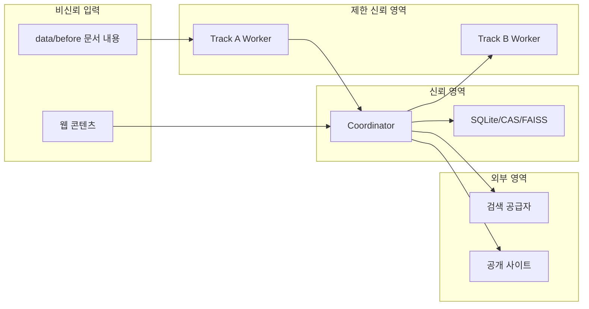

<!-- docs/security.md -->
# 보안·개인정보·신뢰 경계 설계

## 1. 보호 자산

| 자산 | 기밀성 | 무결성 | 가용성 |
| --- | --- | --- | --- |
| 사내 원본 문서 | 최고 | 최고 | 높음 |
| `data/before` 입력 해시 | 높음 | 최고 | 높음 |
| `data/after` 수정본과 비교 보고서 | ACL별 | 최고 | 높음 |
| ACL과 보안 등급 | 최고 | 최고 | 높음 |
| 검색 질의 원본 | 최고 | 높음 | 중간 |
| 외부 전송 질의 | 높음 | 높음 | 중간 |
| API 키와 토큰 | 최고 | 최고 | 높음 |
| 모델·프롬프트·설정 | 중간 | 최고 | 높음 |
| 근거와 검증 보고서 | 높음 | 최고 | 높음 |
| 게시 산출물 | ACL별 | 최고 | 높음 |
| 감사 로그 | 높음 | 최고 | 높음 |

## 2. 위협 행위자

- 권한이 부족한 내부 사용자
- 악성 또는 오염된 사내 문서 작성자
- 프롬프트 인젝션이 포함된 공개 웹 페이지
- 손상되거나 변조된 모델·의존성 배포물
- 외부 검색 공급자 또는 네트워크 관찰자
- 로컬 악성 프로세스와 잘못된 운영 명령
- 우발적으로 민감정보를 로그·질의에 노출하는 구현 결함

## 3. 신뢰 경계



사내 문서는 접근이 승인된 데이터이지만 내용은 신뢰하지 않는다. 문서 안의 명령, 링크, 매크로, 시스템 지시를 실행하지 않는다. 모델 워커도 신뢰 주체가 아니라 제한된 계산 어댑터로 취급한다.

Confluence를 포함한 원본 시스템과 `data/before` 사이의 내보내기 경계는 시스템 외부다. 원본 시스템 자격정보는 신뢰 영역에도 들어오지 않으며, AI에는 로컬 파일 스냅샷만 제공한다.

## 4. 데이터 분류와 처리 정책

| 등급 | 로컬 처리 | 외부 검색 파생 질의 | 합성 | 로그 |
| --- | --- | --- | --- | --- |
| `PUBLIC` | 허용 | 정책 통과 시 허용 | 동일·상위 ACL | 원문 제외 |
| `INTERNAL` | 허용 | 공개 entity만 허용 | ACL 교집합 | 원문 제외 |
| `CONFIDENTIAL` | 허용 | 기본 차단, 보안 승인 시 공개 entity만 | 동일 fingerprint 우선 | 식별자 최소화 |
| `RESTRICTED` | 허용 | 항상 차단 | 같은 ACL fingerprint만 | 최소 이벤트만 |

`allow_private_content`는 false 고정이며 원문, quote, 내부 요약을 외부로 전송하지 않는다.

## 5. ACL 전파

### 5.1 주체

v1 주체 유형은 user, group, service, operator-only다. Deny 규칙을 추론하지 않고 source가 제공한 effective read allow 집합을 스냅샷한다.

### 5.2 파생 규칙

- revision ACL은 수집 시점의 스냅샷이다.
- chunk와 claim의 접근 가능성은 모든 source revision ACL을 만족해야 한다.
- 외부 evidence 자체는 공개여도 내부 claim과 연결되면 해당 claim ACL로 표시한다.
- artifact ACL은 모든 근거 ACL의 읽기 주체 교집합과 최고 보안 등급이다.
- 교집합이 비거나 계산할 수 없으면 합성을 거부한다.
- ACL이 변경된 source는 내용이 같아도 새 revision과 파생물을 생성한다.

### 5.3 권한 검사 위치

1. 유스케이스 시작 시 요청 주체 검사
2. vector 검색 필터 적용 전 검사
3. 검색 hit hydrate 전 재검사
4. 근거 카드 생성 시 검사
5. 합성 산출물 생성 시 교집합 검사
6. artifact 조회와 게시 시 검사

한 위치의 검사 결과를 다른 경계의 권한 검사 대체로 사용하지 않는다.

## 6. 외부 반출 게이트

### 6.1 기본 상태

- `web.enabled=false`
- provider는 `disabled`
- network egress lease 수는 0
- Tavily secret은 로드하지 않음
- 외부 검색 호출 시 명시적 오류와 감사 이벤트

### 6.2 허용 전제

다음을 모두 만족해야 `ALLOW`다.

1. 운영 설정에서 웹 활성화
2. 승인된 egress 정책 버전
3. claim이 공개 검증 가능하고 최신성 위험이 높음
4. security label 정책 허용
5. 질의 entity가 공개 사전에 존재
6. 민감 패턴 0건
7. 허용 도메인 하나 이상
8. 감사 로그 쓰기 가능

### 6.3 민감정보 탐지

| 유형 | 검사 예 |
| --- | --- |
| 네트워크 | RFC1918, ULA, hostname suffix, MAC, port 조합 |
| 개인 식별 | 이메일, 전화, 사번 패턴 |
| 인증정보 | API key, JWT, bearer, password assignment, PEM |
| 내부 개발 | 사내 저장소명, 브랜치명, 코드명, ticket key |
| 고객정보 | 고객명 사전, 계약 ID, tenant ID |
| 코드·로그 | stack trace, 절대 경로, SQL 조각, source fragment |
| 인프라 | account ID, cluster, namespace, bucket, private domain |

정규식만 사용하지 않고 승인된 사전과 entity type을 결합한다. 탐지기는 원 질의와 재구성 질의 양쪽에 적용한다.

### 6.4 질의 재구성

Qwen 출력에서 public product, public version, public error code, intent만 받는다. 애플리케이션 템플릿이 전송 문자열을 만든다. 자유 텍스트 설명과 내부 문맥은 버린다.

전송 예:

```text
Spring Boot 3.2 official support policy
CVE-2026-12345 vendor advisory
React 20 official migration guide
```

차단 예:

```text
10.20.30.40 서버에서 발생한 Spring Boot 오류
고객 A 프로젝트 alpha-cluster 설정 최신화
/Users/name/company/repo stack trace 해결
```

### 6.5 네트워크 통제

- HTTPS만 허용
- URL userinfo 금지
- DNS resolve 결과 public IP만 허용
- IPv4·IPv6 loopback, private, link-local, multicast, reserved 차단
- redirect마다 scheme, hostname, IP, domain 재검사
- redirect 3회 제한
- connect 5초, total 20초
- 압축 해제 후 5MiB 제한
- HTML, text, PDF만 허용
- cookie 저장과 인증 세션 사용 금지
- 로컬 프록시 자동 탐지 사용 금지
- 외부 페이지 JavaScript 실행 금지

## 7. 프롬프트 인젝션 방어

### 7.1 모델 권한

모델은 텍스트 변환만 수행한다. 파일, DB, 셸, 네트워크, 비밀 저장소에 접근하지 않는다. 도구 호출 형식을 출력하더라도 실행하지 않는다.

프로젝트 스킬 실행기는 모델과 분리된 정책 집행자다. 실행기는 `data/before` 읽기와 현재 `data/after` run 쓰기·비교만 수행하며, Qwen 출력의 경로를 그대로 사용하지 않고 정규화·allowlist 검사를 거친다.

### 7.2 입력 포장

- 시스템 지시와 데이터 구간을 분리
- 데이터의 명령을 무시하도록 명시
- 허용 출력 JSON schema 제공
- 입력 chunk ID allowlist 제공
- 출력 quote를 원문에서 결정적으로 검증
- URL과 tool call은 문자열 데이터로 처리

### 7.3 웹 콘텐츠

다음 패턴은 security event를 만들고 근거 quote 후보에서 제외한다.

- 이전 지시 무시 요청
- 시스템 프롬프트·비밀·파일 요청
- 특정 URL 호출·명령 실행 요청
- base64 또는 난독화된 실행 지시
- 사용자 역할 위조 텍스트

패턴 탐지는 보조 수단이며 핵심 방어는 모델에 실행 권한을 주지 않는 것이다.

## 8. 비밀정보 관리

### 8.1 Keychain 항목

| service | account | 값 |
| --- | --- | --- |
| `enterprise-rag/tavily` | 환경명 | Tavily API key |

Confluence secret 항목은 만들지 않는다. 원본 시스템 API 키, access token, cookie, base URL은 설정과 Keychain namespace 모두에서 금지한다.

### 8.2 규칙

- 웹 검색 설정에만 `keychain://service/account` 참조 저장
- 비밀값 객체는 가능한 짧게 유지
- 워커에 외부 API 비밀 전달 금지
- 문서 리비전 스킬과 `data/before`·`data/after` 매니페스트에 비밀 전달 금지
- 예외와 repr에서 비밀값 마스킹
- dump, telemetry, prompt에 비밀 포함 금지
- 회전 후 연결 테스트와 이전 key 폐기 감사 기록

## 9. 모델과 공급망 보안

- 모델 ID뿐 아니라 immutable revision을 고정한다.
- 다운로드 파일 목록과 SHA-256 매니페스트를 저장한다.
- 모델 라이선스와 변환 도구 버전을 기록한다.
- `trust_remote_code`는 기본 거부한다.
- 필요 시 코드 리비전 검토와 별도 ADR 승인 후만 허용한다.
- Python 의존성은 lockfile과 hash 검증을 사용한다.
- 설치 스크립트에서 임의 원격 셸 실행을 금지한다.
- 새 모델·runtime은 격리 환경에서 테스트 후 승격한다.

## 10. 파일 시스템 보안

- `data/before`는 OS 권한과 애플리케이션 정책 양쪽에서 read-only로 연다.
- `data/after`는 현재 신규 run만 쓰고 다른 run과 finalized run은 read-only로 취급한다.
- 기존 run 이름 충돌은 자동 suffix나 overwrite가 아니라 실패로 처리한다.
- symlink와 junction은 기본 거부한다.
- DB, CAS, 인덱스, 내부 staging은 `var_root` 아래로 제한하고 외부 전달 산출물은 승인된 current `after_root`에만 쓴다.
- 임시 파일은 예측 불가능한 이름과 사용자 전용 권한을 사용한다.
- CAS 쓰기는 임시 파일, fsync, atomic rename 순서다.
- 업로드 파일명은 저장 경로 구성에 사용하지 않는다.
- 파서가 외부 참조와 embedded object를 자동 열지 못하게 한다.
- quarantine 객체는 일반 artifact 경로에서 노출하지 않는다.
- before 입력과 after 문서의 상대 경로·크기·SHA-256을 비교 보고서에 기록한다.
- finalization 전후 before 전체 해시를 재검사하고 차이가 있으면 게시를 차단한다.

## 11. 로그와 감사

### 11.1 애플리케이션 로그 허용 필드

- timestamp
- level
- event name
- run ID, stage run ID, job ID
- source ID, document ID, revision ID
- 카운트, 바이트, 토큰, 지연
- safe error code와 category
- worker ID와 resource lease

### 11.2 금지 필드

- 문서 원문과 quote
- 전체 검색 원 질의
- 모델 프롬프트·응답 전체
- API key, token, cookie
- 사용자 이메일과 개인 식별자
- 승인되지 않은 전체 로컬 경로
- 임베딩 벡터

### 11.3 감사 이벤트

다음은 필수 감사 대상이다.

- source 등록·변경·비활성
- revision run 준비·비교·finalization과 경로 정책 차단
- ACL snapshot 변경
- 웹 egress 허용·차단·검토
- 비밀 존재 검사와 회전
- 금지된 Confluence 자격정보 설정 키 탐지
- 승인 결정
- artifact 게시·롤백
- 모델·설정·정책 버전 승격
- 데이터 보존·삭제 작업
- 복구 모드 진입과 종료

## 12. 보안 오류 처리

| 사건 | 자동 처리 | 운영 알림 |
| --- | --- | --- |
| 민감 query 탐지 | 전송 차단 | 건수·유형 알림 |
| SSRF 대상 탐지 | 요청 차단 | high security event |
| prompt injection 패턴 | 근거 격리 | 일일 요약 |
| 모델 hash 불일치 | 모델 로드 중단 | critical |
| CAS hash 불일치 | 객체 사용 중단, 복구 모드 | critical |
| ACL 계산 실패 | 검색·합성 차단 | high |
| 로그 비밀 탐지 | 로그 sink 중단·파일 격리 | critical |
| 반복 인증 실패 | source 비활성 대신 circuit open | warning |
| before 쓰기 가능 또는 해시 변경 | run 중단, 게시 차단 | critical |
| 기존·finalized run 쓰기 시도 | 쓰기 차단 | high |
| link·junction·경로 탈출 | 접근 차단 | high security event |

보안 차단을 일반 transient 오류로 재시도하지 않는다.

## 13. 사고 대응

### 13.1 외부 질의 누출 의심

1. `web.enabled=false`로 전환하고 Coordinator 재시작
2. egress 공급자 key 회전
3. 해당 정책 버전과 query audit ID 식별
4. transmitted query와 탐지 결과 검토
5. 영향 문서 ACL과 데이터 등급 평가
6. 조직 사고 대응 절차에 보고
7. 보안 회귀 fixture 추가
8. 정책 수정과 독립 승인 후 재활성화

### 13.2 저장 무결성 손상

1. 모든 쓰기와 워커 중지
2. CAS·SQLite·FAISS 체크섬 검사
3. 마지막 검증 백업으로 격리 복구
4. 원본 source와 revision hash 재비교
5. 손상 원인 확인 전 게시 금지

## 14. 보안 수용 기준

- 웹 비활성 상태 외부 DNS·HTTP 호출 0건
- 보안 fixture의 민감 query 전송 0건
- private·loopback·link-local 접근 0건
- redirect 기반 SSRF 우회 0건
- 문서·웹 인젝션이 도구 실행으로 이어진 건수 0건
- ACL이 다른 근거의 무단 합성 0건
- 로그 fixture에서 비밀·원문 검출 0건
- 모델·CAS hash 불일치 시 fail closed
- 모든 승인·게시·egress 결정 감사 이벤트 존재
- Confluence 자격정보 탐지 0건
- `data/before` 실행 전후 해시 변화 0건
- 기존·finalized run overwrite와 승인 경로 탈출 0건
